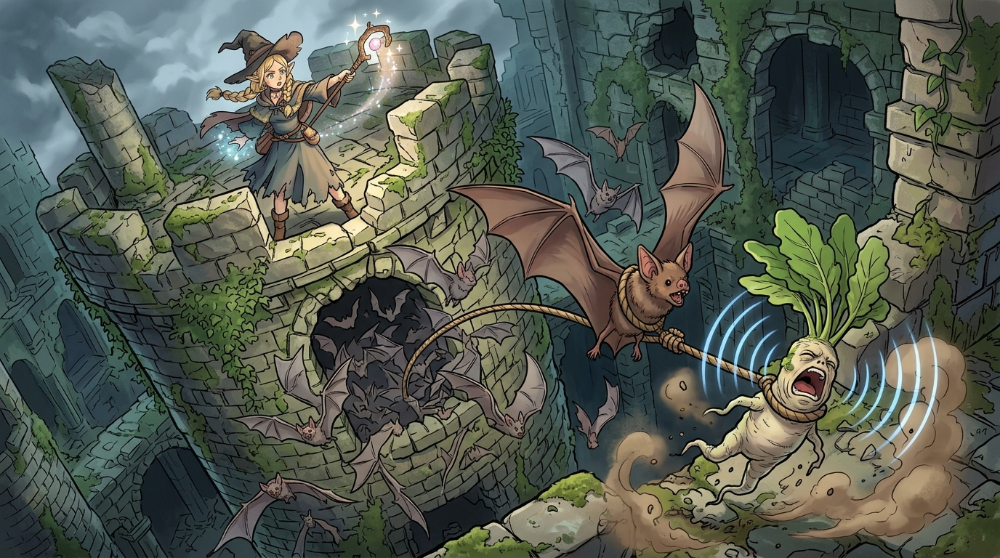

# 🖼️ 尖叫機關與高塔之震：曼德拉草的空中拔除 (Aerial Mandrake Extraction)

### 🌿 學院派理論的現場工程演繹
本作品靈感源自九井諒子漫畫《迷宮飯》（`comic-delicious-in-dungeon`）第 4 話。
面對先西「趁曼德拉草開口前直接剁頭」的粗暴黑手經驗，象牙塔科班出身的精靈法師瑪露希爾試圖證明古典教科書記載的「牽引拔草法」具備合理的邏輯根基。在現場缺乏犬隻的限制下，她精妙地利用了地下城蝙蝠棲息的生態動態，設計出一套「火花驚擾洞穴—蝙蝠飛出索套拉扯—高塔遠程隔離」的空中力學牽引機關。

### ⚡ 忽略物理邊界的反噬瞬間
畫面以極富張力的日式動漫動作分鏡定格了這一機關運轉的巔峰時刻：
青苔斑駁的古老石塔斷壁之巔，身披法袍的瑪露希爾高舉魔杖迸發出湛藍璀璨的魔法火花；下方幽暗石穴中，成群巨蝙蝠在恐慌中如黑潮般狂亂撲翼湧出。其中一隻身套粗麻繩圈的巨大蝙蝠在強大推力下拉緊長索，將深埋於沃土中的人形曼德拉草硬生生拔出地表！
曼德拉草那宛如枯白蘿蔔般的畸形肉身劇烈扭動，裂開巨口爆發出撕裂靈魂的刺耳悲鳴。實質化的藍色聲波同心圓撕裂空氣、捲起狂暴沙塵，被近距離震死的蝙蝠伴隨著失控的草莖呼嘯著朝高塔迎面撞來。

這不僅是一幕充滿戲劇反差的冒險插曲，更是對工程設計的幽默註解：**即使系統的邏輯設計再精巧，一旦低估了反衝力矩與未知擾動的邊界條件，最後迎面砸來的往往是自己親手啟動的代價。**

