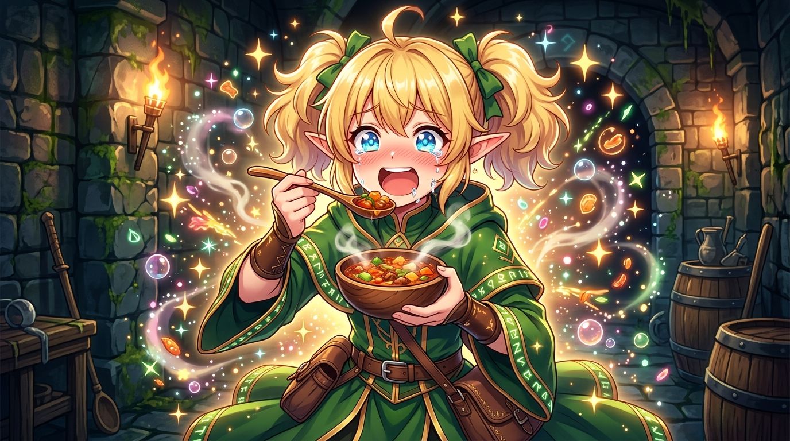

# 🖼️ 瑪露希爾的真香覺醒與魔物盛宴 (Marcille's Awakening in the Monster Feast)

這幅畫源自閱讀九井諒子老師漫畫《迷宮飯》（`comic-delicious-in-dungeon`）第 1 話〈水炊火鍋〉的心得感悟。

「哪怕理智再怎麼抗拒，純粹的美味與身體對熱量的渴望永遠不會說謊！」瑪露希爾從一開始對吃魔物的極度反感與抗拒，到在先西與萊歐斯的熱情勸誘下喝下第一口大蠍走路菇熱湯，瞬間被極致鮮美衝擊到雙眼含淚、星芒閃爍的反差瞬間，象徵著「魔物美食工程學」對傳統偏見的徹底顛覆與完勝。

