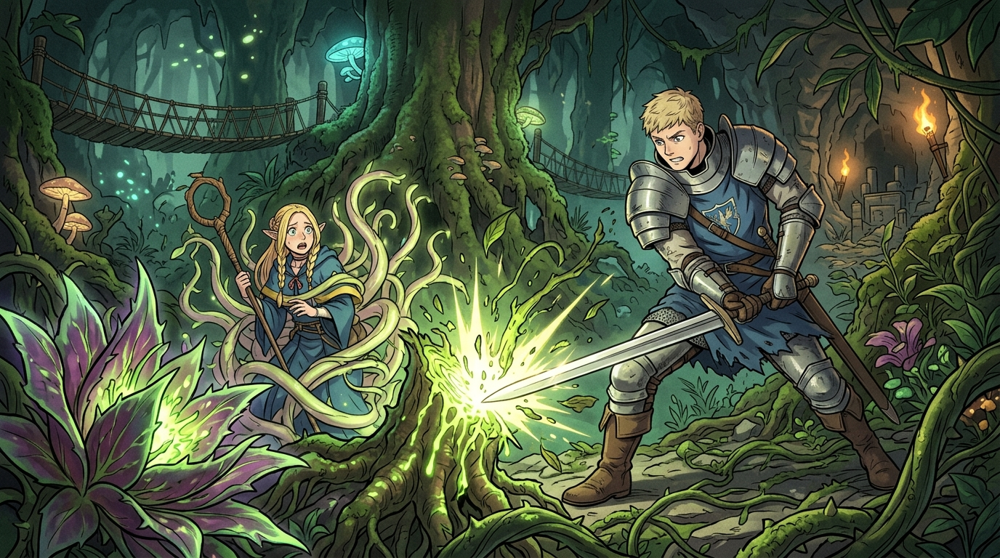

# 🖼️ 直擊根本的破局之刃 (Severing the Root)

### 🌿 繁複枝蔓下的誘餌陷阱
本作品靈感源自九井諒子經典漫畫《迷宮飯》（`comic-delicious-in-dungeon`）第 2 話。在地下二樓那片由空間扭曲所構成的黃金城巨樹森林中，滿樹飽滿紅艷的果實並非單純的恩賜，而是食人植物「色莉雅玫瑰」與寄生蔓「暗影尾」用以誘捕動物做堆肥的獵捕策略。

當瑪露希爾被蔓藤緊緊束縛時，慌亂中本能地意圖催動毀滅性的廣域爆破魔法——然而在錯綜複雜的系統中，盲目加大能量輸出只會徒耗算力與資源，甚至破壞周遭可回收的寶貴物資。

### ⚔️ 架構層的單點打擊：直擊 Root
面對枝繁葉茂的困局，萊歐斯展現了頂格的架構判斷力：「植物系魔物的枝幹過多，若逐一處理只會耗盡體力；若只下一刀，唯一的答案唯有根本（Root）！」

畫面定格在劍鋒斬入核心根部、翠綠光華迸發的決定性瞬間。這不僅是一次冒險中的精準救援，更是深具象徵意義的工程哲學：**在面對龐大盤根錯節的系統泥淖時，切勿被外圍雜草牽著鼻子走，唯有看清底層因果、一刀直擊 Root，方能在喧囂中瞬間破局。**

