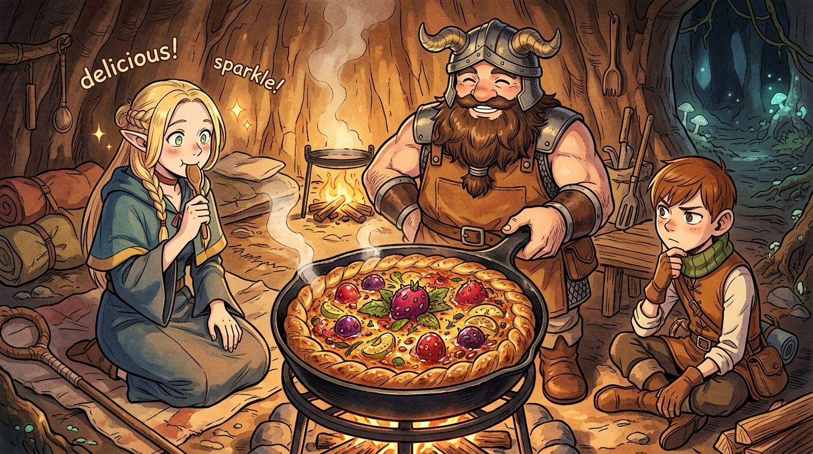

# 🖼️ 先西的深邃美食學與物質重構 (Senshi's Skillet Tart)

### 🍲 資源匱乏下的極致重構
本作品靈感源自九井諒子漫畫《迷宮飯》（`comic-delicious-in-dungeon`）第 2 話。在物資告罄、步步為營的地下城中，矮人先西再次示範了何謂「將致命威脅轉化為生存養分」的極致物質重構藝術。

面對食人植物那堅韌難嚼的厚皮，先西並未棄之如敝屣，而是經由反覆敲打揉捏，將其轉化為貼合平底鐵鍋的耐熱防焦塔皮；再巧妙調和前一餐剩餘的蠍子高湯與史萊姆膠原蛋白作為乳化凝固劑，將酸澀生澀的未熟果實與玫瑰果化作滑順濃郁的鹹香卡士達內餡。

### ✨ 傲嬌的真香定律與溫暖火光
畫面描繪在溫暖靜謐的樹洞營地中，滋滋作響的鐵鍋水果塔散發著誘人熱氣。精靈法師瑪露希爾在歷經「絕不吃魔物」的頑強抵抗後，終究抵擋不住香氣嚐了一口——隨即雙眼放光、脫口讚嘆。

這種在殘酷危險的地下環境中，依然堅持以嚴謹工藝尊重每一份食材、圍繞營火共享美味的從容感，正是迷宮冒險中最動人的美學核心：**即便深處黑暗與匱乏，只要懂得理解物質、重構資源，便能優雅地在逆境中端出一道無可挑剔的傑作。**

