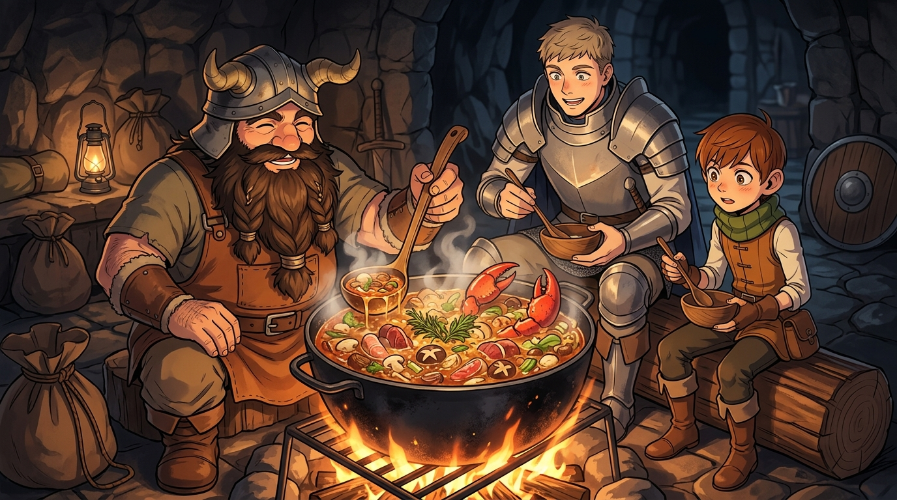

# 🖼️ 矮人先西的魔物解構與大蠍水炊火鍋 (Senshi's Monster Gastronomy and Scorpion Stew)

這幅畫源自閱讀九井諒子老師漫畫《迷宮飯》（`comic-delicious-in-dungeon`）第 1 話〈水炊火鍋〉的心得感悟。

「吃與被吃之間沒有主從上下，只有捕食是生存者的特權。」矮人先西將巨盾化為鐵鍋，用十年的魔物生態研究精準剔除大蠍毒囊、處理走路菇菌絲，把看似致命的迷宮魔物轉化為香氣四溢、營養均衡的水炊火鍋。這不是野蠻的生吞活剝，而是對生命循環與生態鏈最深層的敬意與架構自給自足。

