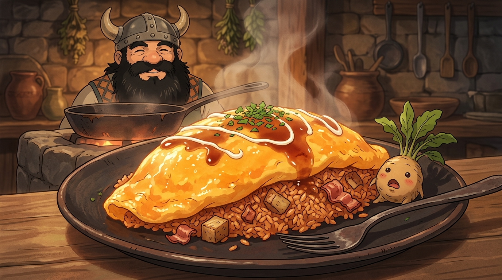

# 🖼️ 黃金蛋包飯與苦澀的昇華：先西的迷宮雙盲宴 (Golden Basilisk Omurice)

### 🍳 異質食材的黃金交響曲
本作品靈感源自九井諒子漫畫《迷宮飯》（`comic-delicious-in-dungeon`）第 4 話。
經歷了驚心動魄的採集風波後，矮人廚師先西在地下城的石灶旁展現了大師級的烹飪煉金術：利用新鮮獵獲的巴西利斯克蛇蛋、煎香的培根油脂，以及兩批經歷截然不同處理方式的曼德拉草，端出了全隊夢寐以求的經典平民美食——「曼德拉草與巴西利斯克的蛋包飯」。

巴西利斯克身為蛇中之王，其蛋長形軟殼且「全無蛋白、純為金紅蛋黃」，飽含豐腴濃稠的極致卵磷脂；經先西鐵鍋翻炒，化為蓬鬆柔嫩、宛如流雲般的金黃厚蛋皮。炒飯內曼德拉草莖切丁與培根交融，在動物油脂的高溫激發下散發出無法抗拒的撲鼻焦香。

### 🌾 痛苦啼鳴的深層去澀機制
畫面以吉卜力與新海誠級別的極致美食動漫畫風，呈現了這份令人垂涎欲滴的地下城珍饌：
深色陶盤上，黃金蛋包飯高高隆起、淋著甘醇深色的特製醬汁與細碎香草，熱騰騰的白霧帶著溫暖的光暈裊裊升起；旁邊盤緣上，一顆水煮後依然大張著嘴、表情滑稽驚恐的小曼德拉草頭被當作特盛配菜可愛地點綴著。背景裡，頭戴牛角盔的先西在灶火前露出慈祥而豁達的笑意。

盲測的震撼結果揭開了本話最深邃的生物學奧秘——先西以砍頭法採收的曼德拉草苦澀難嚥，而經過蝙蝠牽引、淒厲慘叫過的那盤卻無比清脆甘甜！那聲令人膽寒的悲鳴，竟是植物在極限狀態下將體內積累的苦澀生物鹼隨音波排空的天然去毒防禦。
**看似多餘的痛苦宣洩，恰恰是洗淨雜質、換取純粹醇厚的必經之路。** 先西為此向書本知識誠摯脫帽，而這份苦澀昇華為甘甜的蛋包飯，正是迷宮生存哲學最溫暖的具象體現。

