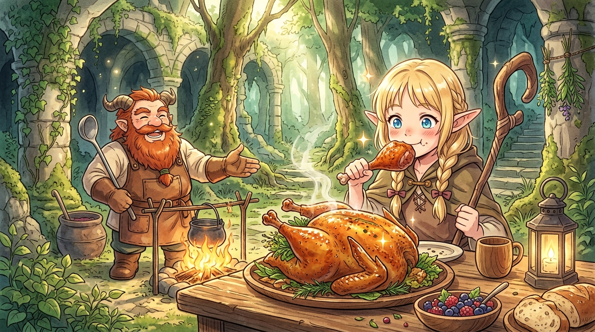

# 🖼️ 香料藥草與金黃烤禽：先西的迷宮滋養宴 (Senshi's Herbal Roast Basilisk)

### 🍲 藥膳烘烤與外科手術級重構
本作品靈感源自九井諒子漫畫《迷宮飯》（`comic-delicious-in-dungeon`）第 3 話。在九成冒險者只靠麵包肉乾硬撐、因營養不良而在魔物爪下接連覆滅的殘酷迷宮中，矮人廚師先西端出的「碳烤巴西利斯克」，堪稱一場外科手術與營養藥劑學的奇蹟融合。

先西將原本令人畏懼的蛇尾雞怪川燙去羽、斬除毒爪，化為潔白肥美的全禽胚體；更將迷宮採集的解毒草、高級藥草、麻痺解除草、石化解除草等生澀苦藥作為填料全數塞入雞腔，以手術縫合線綁好切口。在營火慢火旋轉燻烤下，豐沛的雞油滲透藥草逼出脂溶性精華，將致命毒物的肉身昇華為能溫熱五臟、解毒強身的大補全雞。

### ✨ 真香定律與生活的真諦
畫面以溫馨細膩的日式動漫美食畫風，捕捉了林間石柱下這場治癒人心的野炊盛宴：整隻烤雞表皮酥脆金黃、油光瀲灩，藥香與肉香在柔和的微光中化作裊裊白煙。精靈法師瑪露希爾手持肥嫩烤雞腿，雙頰泛紅、雙眼閃爍著被極致美味征服的純粹幸福，徹底將魔法師的矜持拋諸腦後；先西手持大湯勺開懷大笑，驕傲地展示著這份飽含生活哲理的傑作。

「規律生活、改善飲食、適度運動」——先西看似樸素的箴言，恰恰道破了探險的最深智慧：**在幽暗險惡的深淵裡，唯有善待自己的感官與胃袋，讓進食不再只是苟延殘喘的補充，生命才能在絕境中綻放出無可動搖的從容與光彩。**

