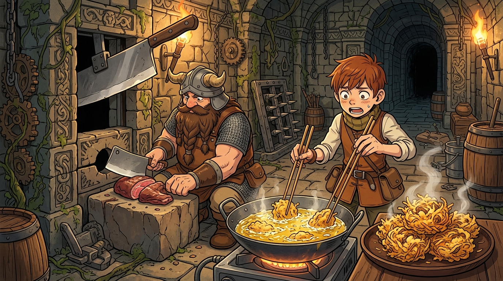

# 🖼️ 殺戮機關的逆向工程：先西的陷阱油鍋與炸什錦 (Reverse Engineering the Killing Trap)

### 🏰 威脅化為設施：地下城生態學的逆向工程
本作品靈感源自九井諒子漫畫《迷宮飯》（comic-delicious-in-dungeon）第 5 話「炸什錦」。
在常人眼中，地下城中密布的落石、噴火與利刃是奪人性性命的修羅場；半身人鍵師奇爾查克肩負全隊安危，以極度緊繃的神經嚴格劃分專業邊界，厲聲告誡隊友「各司其職、絕不准越界觸發機關」。

然而，矮人廚師先西卻展現了超越常軌的洞察力——當滾燙的陷阱油噴湧而出時，他第一時間以舌尖辨析出這座沉沒古城昔日橄欖產地的歷史沉澱，判定此乃純度極高的陳年橄欖油！先西毫無遲疑地將殺戮陷阱「逆向工程」為野外最奢侈的烹飪設施：噴油孔化作 180 度精準恆溫的炸鍋，呼嘯落下的斷頭刀陷阱化為精準肢解巨蝙蝠肉塊的自動剁刀。

### 🍤 恆溫與火候的工程美學
野外料理向來受制於柴火飄忽不定的油溫，難以炸出酥脆輕盈的天婦羅。但迷宮防禦工匠留下的恆溫油室，恰好補足了烹飪中最嚴苛的技術短板！
畫面捕捉了這幕極具戲劇張力與黑色幽默的瞬間：
石壁機關齒輪交錯的古老秘室中，滾燙金黃的油鍋滋滋作響，曼德拉草細絲與醃製巨蝙蝠肉裹上巴西利斯克濃稠蛋液麵衣，在沸騰的油泡中翻滾凝結；原本誓死捍衛解鎖專業的奇爾查克，手持長長木筷被推上油鍋前，神情既震驚、無奈又不得不全力專注地聆聽油泡聲響、把握翻面時機；而在身旁，端坐於斷頭刀切肉砧前的先西笑意盎然，一盤盤金黃堆疊、熱氣裊裊、薄脆多汁的「曼德拉草大蝙蝠炸什錦」正散發著征服靈魂的濃郁焦香。

**最高境界的生存智慧，不在於盲目對抗環境，而在於解構威脅的底層本質，將其化為支撐生命的生產力設施。**

