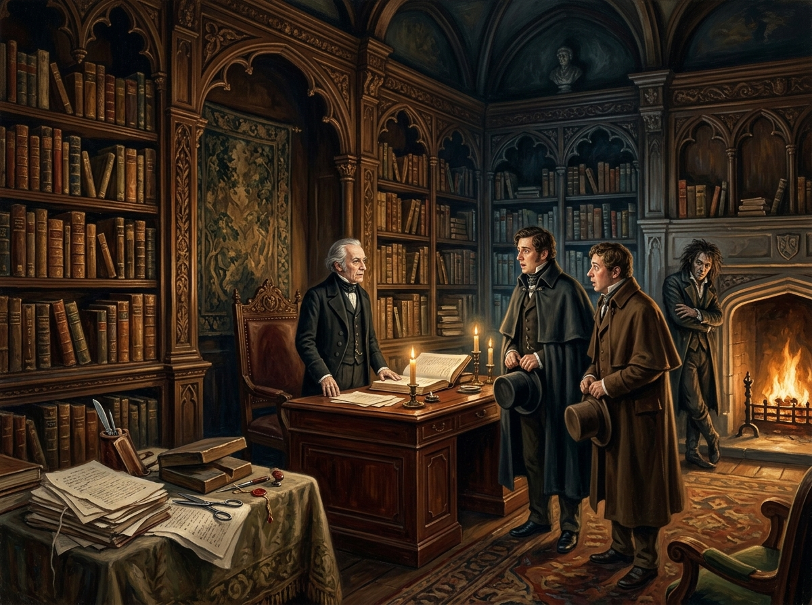

# 實踐派魔法師的宣告 — 何妨寺藏書室

## 畫面焦點與敘事時刻

- **出處**：《英倫魔法師》第一章〈何妨寺的藏書室〉（The Library at Hurtfew Abbey）
- **核心時刻**：在約克郡深處何妨寺那座雕滿秋葉常春藤、充滿小牛皮古籍與不可知光源的哥特藏書室中，矮小而孤傲的諾瑞爾先生站在書桌前，對著滿臉震驚的斯剛德斯與亨尼福特，冷酷而堅定地說出：「魔法在我國並沒有消失。我本人即是一名合格的實踐派魔法師。」
- **引用設定**：`mr_norrell`、`john_segundus`、`john_childermass`、`hurtfew_abbey_library`。

## 構圖與視覺細節

1. **空間與秩序**：高聳的哥特拱頂書架整齊排列著被重新裝訂的古籍，壓銀字體在微光中泛著冷冽光芒，營造出高度控制、密閉且排他的學術聖殿氛圍。
2. **人物對峙**：諾瑞爾先生身形矮小但氣場逼人，雙唇緊抿、目光深邃；斯剛德斯與亨尼福特身披旅塵斗篷，神情充滿敬畏與失語的震撼；背景壁爐旁，齊爾德邁斯頂著烏雲般的亂髮抱胸倚牆，以冷冽譏誚的目光注視這場跨越百年的對話。
3. **真相的刺點**：近景側桌上散落著未裝訂的古手稿、剪刀與裁紙尖刀——無聲地訴說著這座優雅藏書室背後，物理性剪除異端、閹割古老魔法的審查真相。

## 讀後心得

> 「正人君子只研究魔法，絕不碰魔法」——約克清談者的這道道德防線，在何妨寺的一屋子真書與一把裁紙刀面前顯得無比滑稽。諾瑞爾先生的偉大在於他跨越了從理論到實踐的深淵；而他的危險則在於，他以為只要用小牛皮重新裝訂、把野性篇章剪去，就能將整座英格蘭的魔法馴服在自己的書齋裡。封裝越是精確受控，底層被壓制的風暴就越發致命。
