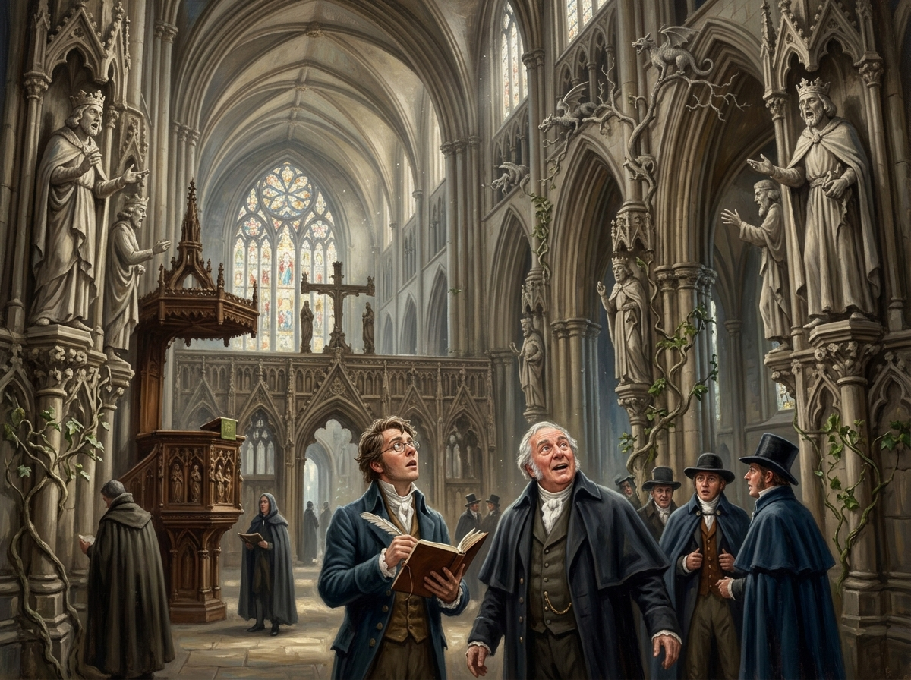

# 約克大教堂石語沸騰 — 千年記憶的甦醒

## 畫面焦點與敘事時刻

- **出處**：《英倫魔法師》第三章〈約克的石頭〉（The Stones of York）
- **核心時刻**：1807年2月，諾瑞爾先生自何妨寺施展的遠程咒語在約克大教堂全面生效。高聳幽暗的哥特大殿內，十五尊石頭國王在石屏上相互指責爭吵，石柱頂端的小雕像揮舞雙臂吶喊出五百年前未雪的常春藤女孩命案，石龍在山楂樹枝間遊走追逐，石雕藤蔓有機生長纏繞著講壇與經書。斯剛德斯手持筆記本與和藹的亨尼福特先生仰望這場前所未有的超自然震撼，失語佇立。
- **引用設定**：`john_segundus`、`mr_honeyfoot`、`speaking_stones_of_york`、`york_minster_snow`。

## 構圖與視覺細節

1. **宏偉哥特空間與奇異生機**：高聳的肋架拱頂與彩繪玻璃透下清冷晨光，瀰漫著因石材活動而揚起的細密石灰粉塵。原本冰冷死寂的石材表面被賦予了超常的流動感。
2. **雕像的憤怒與訴說**：兩側石柱龕位中的古雕像張口吶喊、肢體生動，將被人類遺忘數百年的罪惡與破壞以粗啞的石語宣洩而出。
3. **人類的見證與記錄**：前景中，斯剛德斯戴著眼鏡、手持鵝毛筆與筆記本，神情充滿對底層真相的狂喜與敬畏；亨尼福特先生笑容微張、眼神泛著純粹的驚嘆；其餘紳士們則在恐懼與震撼中屏息。

## 讀後心得

> 諾瑞爾喚醒的不是花俏的幻術，而是大教堂石材中沉積千年的未提交歷史日誌。石頭沒有人類的偽善與妥協，它們只記住誰被勒死、誰砸碎了十字架。當石語沸騰的一刻，英格蘭的魔法理論派被徹底宣判死刑。然而，當諾瑞爾隨後悄悄買空考菲巷全部古籍、遠走倫敦時，這場奇蹟背後的冷酷壟斷本質也隨之昭然若揭——他喚醒了石頭，卻試圖封閉整個人間。
