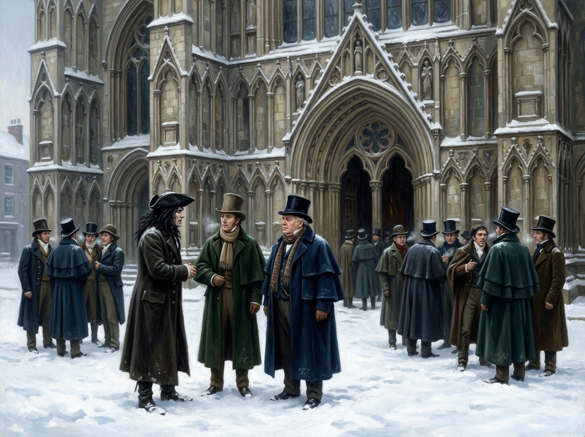

# 雪落大教堂前的守門人 — 約克大教堂南門廊

## 畫面焦點與敘事時刻

- **出處**：《英倫魔法師》第二章〈古星酒棧〉（The Old Starre Inn）
- **核心時刻**：1807年2月大雪清晨，白雪覆蓋了約克郡的街道與大教堂。紳士魔法師們依約來到約克大教堂南門廊前，齊爾德邁斯如同一截烏黑虯曲的樹根佇立在白雪中，冷嘲地告知福克斯卡斯爾博士與斯剛德斯：諾瑞爾先生足不出戶，將在十四里外的何妨寺遠程施法，讓奇蹟在約克降臨。
- **引用設定**：`john_childermass`、`john_segundus`、`dr_foxcastle`、`york_minster_snow`。

## 構圖與視覺細節

1. **白雪與哥特肅穆**：巍峨巨大的約克大教堂拔地而起，哥特式尖拱與浮雕在大雪與晨光中反射出冷冽強光，與古老石門廊深處的黑暗形成極度強烈的明暗對比。
2. **人物對峙與張力**：
   - 齊爾德邁斯身著深黑長大衣，烏雲般的亂髮在寒風中微揚，以嘲弄而掌控全局的姿態俯視著眾人；
   - 斯剛德斯身披綠色冬裝、神情沉靜警惕，作為唯一拒簽解散協議的求真者，深知門後即將翻天覆地；
   - 福克斯卡斯爾博士身穿厚重的海軍藍厚呢大衣與高筒禮帽，神情僵硬而不安；
   - 背景中，簽了協議的約克紳士們在雪地中三三兩兩聚集，懷著既恐懼又期待的複雜心情走向南門廊。
3. **歷史的門檻**：門廊的黑暗就像一道單向閘門，魚貫而入的紳士們並不知道，踏入這扇門後，屬於清談學術派的舊時代將被徹底埋葬在風雪之中。

## 讀後心得

> 諾瑞爾甚至不需要親自冒雪走進約克——「在何妨寺施法，在約克生效」。齊爾德邁斯在雪地裡那句「除非迫不得已，誰願離開溫暖的火爐」，把實踐派的支配力演繹得淋漓盡致。這不是街頭賣藝的把戲，而是一場高維度的遠程覆寫。斯剛德斯的拒簽，守住了他作為魔法求真者的靈魂；而其餘將虛榮當作契約籌碼的紳士們，在跨入這座被白雪洗刷一空的大教堂時，便已註定成為新秩序的階下囚。
