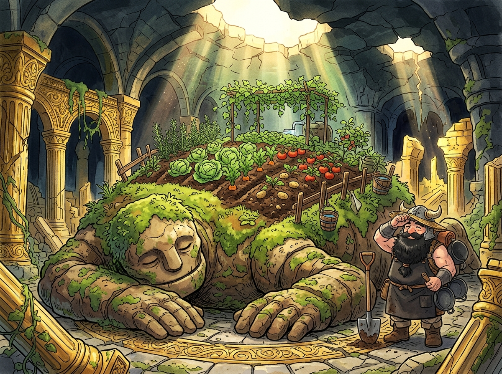

# 🖼️ 巨魔像的自走溫室：逆向工程的生態農田

來源出處為《迷宮飯》（comic-delicious-in-dungeon）第 8 話「燉捲心菜」（0008，p.1-24）。當常規冒險者將巨魔像視為「擋路的魔法障礙」、或是學院派法師死守著「99% 土石魔法生物」的抽象標籤時，矮人先西卻展現了頂級工程師的逆向架構思維——吹響口哨引出巨魔像，精準撬下十字核心使其平整伏臥，化作迷宮中最肥沃的溫室苗床。

巨魔像的體內終年維持著恆定溫濕度，體表植物紮根反而能穩固其外殼結構；它會自主管理水分（葉水與腰水），還能驅逐害蟲與偷菜賊。先西甚至預防連作障礙而輪替種植，將殺戮人造物徹底重構為自給自足的自動化生態節點。

本作品定格於迷宮地下三層的古老廊柱廢墟：天井灑落的溫暖魔光下，龐大沉睡的泥土巨魔像背負著整齊翠綠的捲心菜、胡蘿蔔與馬鈴薯田，先西手持鐵鏟站在一旁抹去汗水。這份將敵對威脅轉化為生產設施的從容，正是超越二元對立的高維生存美學。

