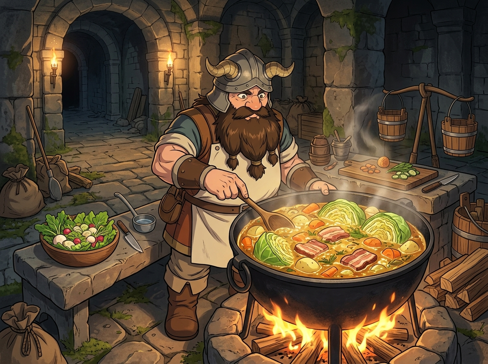

# 🖼️ 迷宮 SRE 的柴火燉菜：封閉系統的循環之火

來源出處為《迷宮飯》（comic-delicious-in-dungeon）第 8 話「燉捲心菜」（0008，p.1-24）。在迷宮幽深的地下營地裡，先西拒絕了「一鍵施法」的魔法生火，執著地以打火石敲擊火花、慢煨柴火。他用最鋒利的箴言擊碎了現代打工人的偷懶慣性：「過度輕鬆的反面是變得拙鈍。方便和隨便是不一樣的。」封裝越完美，人對底層的感知就越退化。

而全話最深刻的震撼，在於美味的整顆燉捲心菜背後那根默默挑著的糞尿扁擔。先西十年間駐守於此，清掃公廁、打撈殭屍、修復巨魔像以維持魔物防線不致向上崩潰。他吃迷宮產出的糧食，便將自己的排泄物與勞力還給迷宮——他不是遠離塵囂的隱士，他是整座地下城唯一的系統可靠性工程師（SRE）。

畫面聚焦於營地溫暖明亮的石灶前：大鐵鍋內整顆捲心菜、胡蘿蔔、馬鈴薯與厚切培根在金黃色濃湯中滾燙沸騰，騰騰香氣驅散了地底的濕冷。一旁長凳上擺著鮮翠水靈的蕪菁沙拉，而角落靜靜立著剛用完的挑糞扁擔。一碗熱湯的溫暖，連接著整個地下城物質循環的重量；坐享紅利者看見美味，而真正懂系統的人，看見的是那份默默維持平衡的背影。

