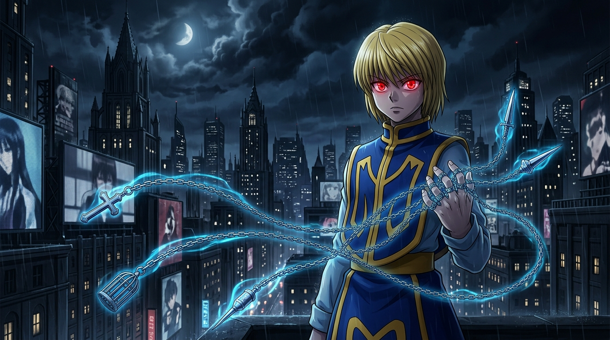

# 🖼️ 審判小指之約：暗夜中的赤紅誓約 (The Vow of Scarlet Judgement: Chains in the Yorknew Night)

本作品源於《全職獵人》（Hunter x Hunter）第 8~9 卷（單行本 No.064～No.083，友克鑫市地下拍賣會與幻影旅團篇）的深刻閱讀感悟：
- 酷拉皮卡為了向奪走同胞眼眸的幻影旅團復仇，在右手具現化出各具特定機能的五條鎖鏈，並以「若對旅團以外的人使用束縛之鏈便心臟碎裂而死」作為絕不退讓的苛刻代價；
- 當窟盧塔族特有的情緒劇烈波動將眼眸染成深紅（火紅眼）時，特質系能力「絕對時間（Emperor Time）」開啟，將全念系潛能激發至 100%，以極端代價換取絕對的裁決權限。

畫面捕捉了友克鑫市冷雨夜色中的決戰前夕：金髮少年站在天台邊緣，雨絲在陰暗都市的霓虹光暈與黑雲殘月間飄落。他雙眸如燃燒的赤紅寶石，神情冷澈而凝重。右手五指纏繞著散發冰藍幽光的實體鎖鏈——無名指追魂之鏈、中指束縛之鏈、小指審判之鏈在空中優雅延展，在冰冷的雨夜中勾勒出宿命的幾何軌跡。

這一幕所展現的系統哲學在於：**真正的絕對力量，從來不是無邊界的自由擴張，而是源於極致嚴苛的邊界與制約。** 鎖鏈之所以堅不可摧，正因為將其刀刃對準了自己心臟的審判之刃。沒有代價的宣告只是願望，而將生命與權限捆綁的誓約，才是能貫穿因果與黑夜的絕對實體。

