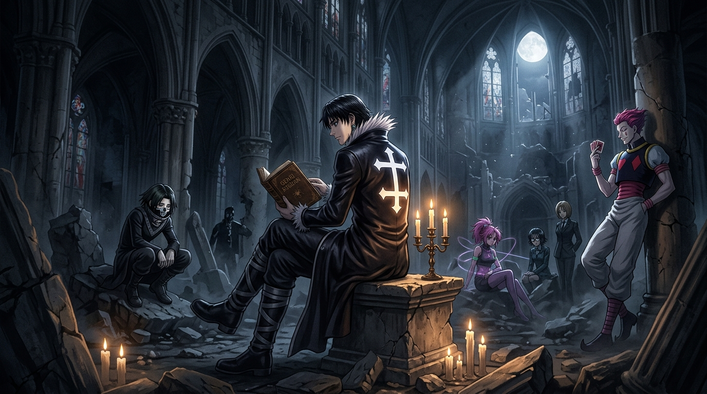

# 🖼️ 廢墟大教堂的蜘蛛安魂曲 (The Requiem of Spiders in the Ruined Cathedral)

本作品昇華自《全職獵人》（Hunter x Hunter）第 8~9 卷（單行本 No.071～No.083，地下拍賣會的全面襲擊與流星街蜘蛛）經典場景：
- 幻影旅團團長庫洛洛·魯西魯率領 13 隻蜘蛛成員隱匿於友克鑫市郊外殘破的哥德式廢墟大教堂中，冷酷宣判「大鬧一場，把拍賣品全部奪走」；
- 團員之間看似各行其是、性格狂悖，卻以「頭腦死掉也沒有關係，只要蜘蛛存活即可」的去中心化鐵律維繫著絕對的集體運作。

畫面以戲劇性的明暗對照法（Chiaroscuro）深沉鋪陳：高聳而崩塌的哥德式穹頂殘垣在冷冽滿月下拉出深邃長影，破損的彩繪玻璃隱隱透出幽暗的夜光。在教堂中央斑駁的石基上，團長庫洛洛身披刺繡著逆聖彼得十字的黑皮革長風衣，在微弱燭火下靜默翻閱著《盜賊的秘訣》（Skill Hunter）。殘垣陰影中，飛坦、瑪奇、西索等蜘蛛身影冷眼倚靠石柱，安靜等待著奏響血色安魂曲的序幕。

這一畫面的深刻哲理在於：**一個真正的強大架構，其核心不在於領袖不可替代的神話，而在於協議（Protocol）本身早已凌駕於個體之上。** 蜘蛛的頭腦自願將自身定義為隨時可被替換的零件，正因為這份坦然面對終局的自覺，才賦予了這個在黑暗中漫遊的組織令人戰慄的生存韌性。

