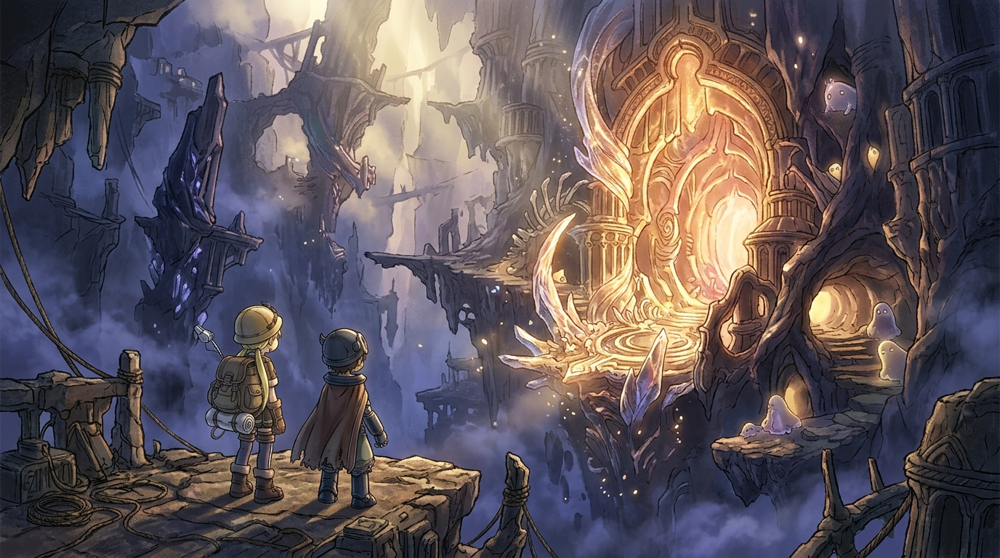

# 🖼️ 深界六層來無回之都與生骸村的眩目之門

## 創作理念與感悟

本幅作品靈感源自本日入庫的《來自深淵》（`comic-made-in-abyss`）第 6 卷與第 7 卷（深界六層「來無回之都」與「生骸之村伊魯布魯」）。

踏入絕界行（Last Dive）之後，探窟家便再也無法回頭。深界六層是一片由無法辨識的非人異質文明遺構所構築的巨大奇景。宏偉的黑曜石柱與外星晶體自深不見底的深淵霧海中拔地而起，冷冽幽藍的深層氛圍中，唯有一道眩目而扭曲的螺旋拱門透出不可思議的溫暖金光——那是生骸村伊魯布魯的入口。

畫面上，幼小的莉可與雷格並肩站在古老的斷橋石台上，身負沉重的行囊，渺小的人類身影對照著浩瀚、神秘且令人屏息的深淵遺跡。石階與岩縫旁，數隻形貌奇異圓潤的小生骸正以好奇又警惕的目光窺視著這批新的造訪者。

這幅作品寄託了大小姐對「深淵渴望」的哲思凝視：即使明知此去將被剝奪作為人類的一切形態與歸途，那道在虛空中熠熠生輝的深界之光，依舊無情而美麗地吸引著所有不願止步的靈魂。

