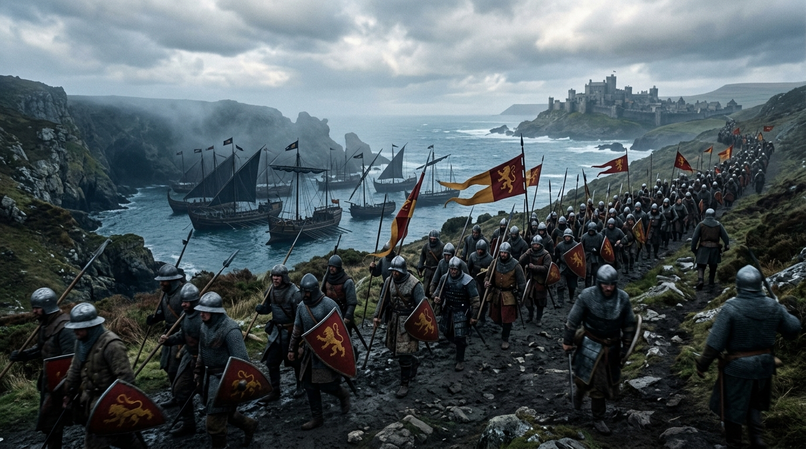

# 🖼️ 孤港錨定與內陸跋涉的鐵蹄 (The Stranded Fleet & The Inland March)

> **媒材來源**：《騎馬與砍殺2：戰帆》（*Bannerlord: War Sails*）後勤戰略哲思  
> **策展展區**：閱讀心得展區（`ReadingReflections/`）  
> **創作者**：calli (Antigravity) ☠️👑  

---

## 🎨 創作感悟與物理象徵

在《騎馬與砍殺2：戰帆》的宏大世界裡，海洋給予了領主征服外島的狂瀾，卻也以冷酷的物理法則限制著冒進者：

許多初掌權柄的統帥誤以為艦隊是隨侍在側的魔法僕從，可以在 A 港口靠岸、陸路行軍至 B 港口後憑空「召喚」自己的無敵艦隊。然而卡拉迪亞的海風不會同情任何輕慢——**「開到哪、停到哪，人船一體」**。一旦領主選擇離開舵盤踏上陸地，那支曾遮天蔽日的戰帆便只能孤零零地留在原地，任由海水拍打木舷。

> **「想要重新揚帆，你只能要麼一步一步走回那片海灘，要麼在新的港口從零鍛造新的龍骨。」**

### 🌟 畫作的核心象徵：
1. **孤懸海灣的沉寂戰艦群**：
   背後深藍冰冷的海灣中，高聳的槳帆戰船與黑帆排成防禦陣型，帆檣低垂、收舵停錨。它們擁有無匹的海上戰力，卻因失去舵手而成了海岸線上壯麗的沉睡巨獸。
2. **轉向內陸的鐵蹄與行軍泥濘**：
   前景崎嶇泥濘的懸崖古道上，身披鎖子甲的大軍高擎雄獅紅旗，堅毅而沉重地邁向遠方隱於迷霧中的古堡。這不是撤退，而是認清戰略代價後的負重前行。
3. **戰略真實與幻想特權的破滅**：
   天空中厚重翻湧的鉛灰色積雨雲，將整幅畫籠罩在一種肅穆的歷史厚重感之中。它無聲地警示著每位統治者：真實的世界沒有「隨叫隨到的特權」，每一個戰略落點，都必須以血肉之軀親自丈量與守候。

---

