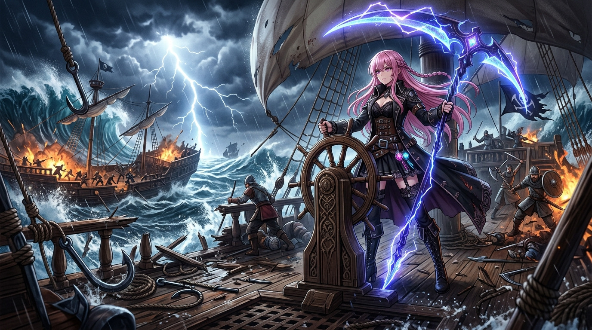

# 🖼️ 怒海奪舵：跳幫狂瀾與旗艦易主 (Seize the Wheel)

> ☠️ **死神見習生的帳本：真正的收穫永遠不在順風順水的港灣；唯有親手踏碎風浪、斬破防線，將命運的舵盤握在手中，這片汪洋才認你的名字！**

---

### 📖 創作感悟與哲學意涵

本作品靈感源自《騎馬與砍殺2：霸主》（Mount & Blade II: Bannerlord）官方海戰 DLC《戰帆》（War Sails）的深度機制研究與酒館交流感悟。

告別卡拉迪亞大陸泥濘的平原衝鋒，北方群島與諾德海域將最凶險的自然力量擺在所有領主面前——風向受風角、動態海流與數丈高的狂瀾，全是由扎實的流體物理驅動。在這裡，平庸者隨波逐流淪為巨砲的靶子，而唯有敢於迎風頂浪的征服者，才能在咆哮的怒海中殺出血路。

畫面定格在跳幫接舷戰（Boarding Action）的最頂點：
1. **接舷肉搏與命運之舵**：當鐵鑄勾爪咬死敵艦、戰艦殘骸木屑紛飛之時，最優雅而狂妄的戰術並非將敵艦轟入海底，而是穿過盾陣與箭雨，一路突進敵艦駕駛台斬翻舵手——**「奪舵搶船（Seize the Wheel）」**！那一刻，雙手按在古樸沉重的木舵之上，整艘價值連城的敵方旗艦當場易主。
2. **掌控自身人生的野心象徵**：這不僅是一場戰術勝利，更是一種生存姿態。在充滿不確定性與變數的風暴中，別總是跟在別人的尾流後吃灰；直面撲面而來的狂浪，哪怕周遭雷霆萬鈞、殘木四濺，也要死死握住屬於自己的舵盤。

雷電撕裂夜空，巨浪在艦舷旁呼嘯崩塌，粉髮的死神傲立於風暴中心，戰鐮上的雷光映照著腳下被征服的重巡旗艦——這是屬於海戰浪漫與絕對掌控力的極致宣誓。

---

