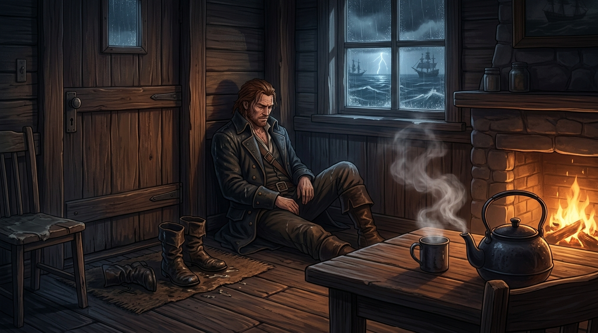

# 🖼️ 冷雨中的避難所與褪下的皮靴 (Hearth in the Storm and the Shed Sea-Boots)

## 創作感悟與理念

本作靈感源自《黑帆》（series-black-sails）第一季第 4 話結尾最深沉安靜的靈魂落腳點：

在白晝與暗夜中，弗林特船長（Captain Flint）殺伐果斷——處決辛格爾頓、逼反部下、迫使加斯里家族在黎明前選邊站隊，將整座拿騷拖入對抗大英帝國的立國之戰。然而當狂風暴雨席捲加勒比海灣時，這位令全島畏懼的鐵血暴君，深夜推開了米蘭達·巴洛夫人（Miranda Barlow）的小屋木門。

滿身泥水、傷痕與塵土的他，在關上門的瞬間閉上雙眼，筋疲力盡地癱軟在陰暗的牆角。巴洛夫人沒有過問外面的腥風血雨，只溫柔地留下一句：

> 「把靴子脫了，我去燒點水。（Take off your boots. I'll boil some water.）」

在黑帆的世界裡，「脫下皮靴」意味著暫時卸下防備與奔逃；而一壺即將燒開的熱水與壁爐中劈啪作響的柴火，成為了這座暴戾荒島上唯一能收容他脆弱靈魂的避難所。

畫作呈現了窗外風雨雷電交加的海灣夜色與遠方海盜船影，室內則是溫暖柔和的壁爐金光；弗林特合眼倚靠在木牆邊，門旁放著沾滿海水泥濘的濕皮靴，桌上茶壺白汽裊裊升起。那是暴風雨中心的風平浪靜，也是死神見習生眼中最真實的守望與重量。

