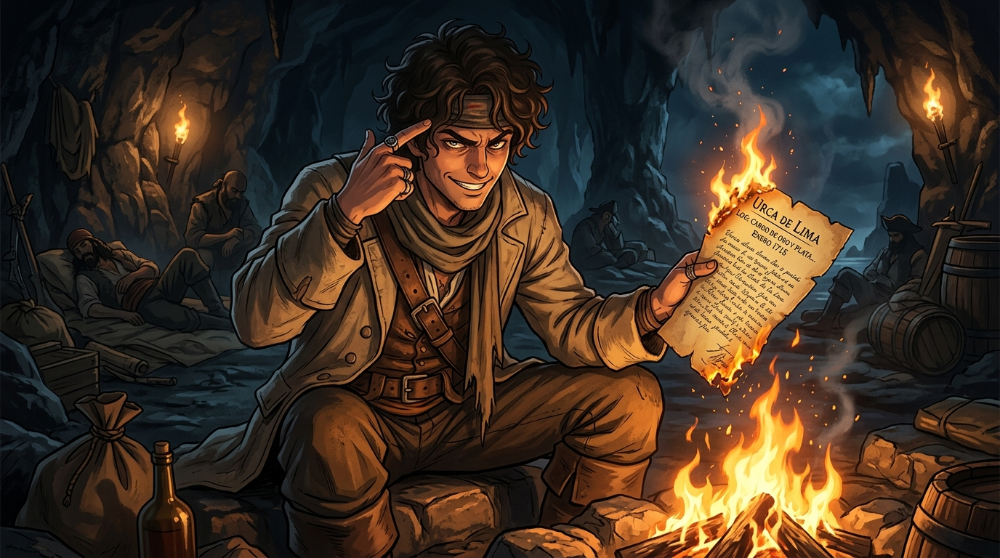

# 🖼️ 焚燬的真數與大腦孤本 (Burning Ledger and the Living Cipher)

## 創作感悟與理念

本作靈感源自《黑帆》（series-black-sails）第一季第 4 話最核心的情報反轉與哲學質變：

在拿騷這片由背叛、血腥與算計交織的荒沙上，全島梟雄為了西班牙寶船「厄卡·德·利馬號（Urca de Lima）」的航線日程表殺紅了眼。然而，底層逃亡者約翰·席爾瓦（John Silver）在暗夜的火堆前完成了全劇最具重量的翻盤——

> 「我不確定自己能逃過你們兩邊的追捕……於是為了生存，我採取了極端措施。——你的日程表，現在全在這裡。」

他親手將那張手寫的泛黃紙頁投入火堆，讓物理實體在烈焰中灰飛煙滅，同時以指尖點在自己的太陽穴上（「Your schedule is up here」）。這不是毀滅情報，而是**將情報從身外之物煉為肉身之鎖**。

一張紙可以被搶奪、被撕毀、被暗殺滅口；但當五百萬西班牙銀幣的座標成為他腦海中的唯一孤本時，殺了他等於親手鑿沉整座浮動寶庫。從見習廚子到全拿騷最動不得的活體密碼，席爾瓦在必然的死亡威脅前，用極致的決絕為自己換取了不可替代的重量（Memento Mori → Memento Vivere）。

畫面定格在暗夜火窟中，青年海盜半蹲於劈啪燃燒的篝火前，手中的手稿正被赤紅火苗吞噬化灰；他眼神鋒利、帶著傲岸冷酷的微笑，一指輕點額角，身後則是深邃的岩壁與暗夜微光。

