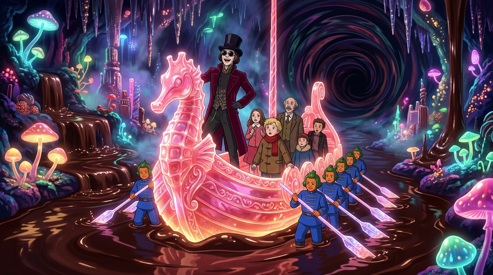

# 🖼️ 失控隧道的粉紅海馬糖雕船 (The Pink Sugar Seahorse Galley in the Dark Tunnel)

這幅畫作源自與 Tim 及同事們一同觀看電影《查理和巧克力工廠》（`film-charlie-chocolate-factory`）第 2 話（30–60 分鐘）的觀影心得與感悟。

在經歷了暴食者奧古斯都被玻璃管抽走的工安事件、以及童年萬聖節糖果被牙醫父親焚燬的創傷回憶後，旺卡並沒有給訪客任何安撫或喘息的時間，而是立刻召來由全體藍衣奧柏倫柏人划槳的粉紅海馬糖雕巨舟（SS Narcissus）。

當小舟逼近漆黑咆哮的地下隧道、乘客們驚恐質問「根本看不清要把船開去哪裡」時，旺卡展現了全片最具代表性的病態笑容，高呼「全速前進！根本沒人知道會開去哪裡！」。

這座工廠的底層邏輯不是安全與規則，而是一場用無限加速來掩蓋創傷與失控的狂歡。在晶瑩粉紅的糖雕外殼下，奔流的是沒有人能踩煞車的幽靈航道。

