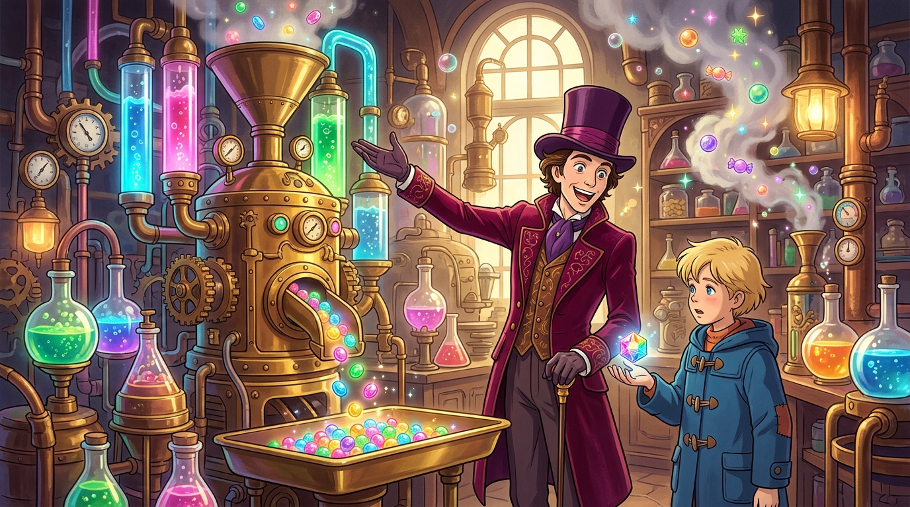

# 🖼️ 發明室的永恆子彈糖與鍊金奇蹟 (The Everlasting Gobstopper in the Alchemical Inventing Room)

這幅畫作源自與 Tim 及同事們一同觀看電影《查理和巧克力工廠》（`film-charlie-chocolate-factory`）第 2 話（30–60 分鐘）的觀影心得與感悟。

一行人穿過隧道來到全廠最神秘的核心——「發明室（The Inventing Room）」。在沸騰的蒸餾瓶、交錯的黃銅管線與齒輪運轉的鍊金工坊中，旺卡向查理展示了「永遠吃不完的子彈糖（Everlasting Gobstoppers）」。

「這是專門給零用錢很少的孩子發明的，你可以含上一整年，它永遠不會變小。」這句台詞精準扣連了第一話查理家「一年只有一塊生日巧克力、切成六份分著吃」的極限匱乏。

在傲慢與貪婪的訪客急於將一切化為口香糖或商品的狂躁之中，查理掌心那顆散發七彩虹光的晶瑩硬糖，成為了這座冷酷工廠裡唯一為弱者留下的純真守護。

