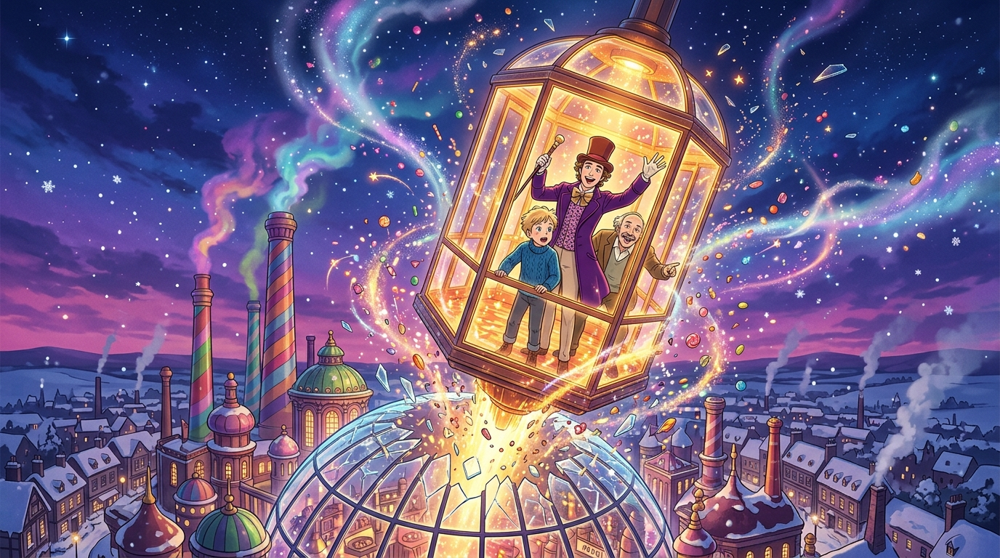

# 《飛向星空的玻璃大電梯與破曉工廠》

### 🎨 創作理念
在《查理和巧克力工廠》第 3 話的最高潮，四位被慾望吞噬的訪客全數出局後，生還者查理與喬爺爺跟隨旺卡登上了全片最瘋狂的載具——**玻璃大電梯（The Great Glass Elevator）**。

旺卡按下了壓抑多年的終極按鈕「**向上飛出去（Up and Out）**」，電梯以極速垂直狂飆。查理驚恐地喊道「但這是玻璃做的！」，旺卡狂笑著要求「必須更快，否則就衝不破屋頂！」。下一刻，透明的玻璃方舟硬生生撞碎了工廠的彩色玻璃穹頂，伴隨著璀璨的糖晶碎片、七彩糖漿蒸氣與漫天雪花，翱翔在維多利亞風格的雪夜小鎮星空之上。

整座工廠在前三話裡是一座完全密閉、隔絕外界長達十五年的工業城堡；而這一刻的破頂而出，象徵著這座孤獨的糖果帝國終於打破了自身的黑箱牢籠，將未來的繼承權與溫暖，朝著腳下那個貧窮卻充滿愛的小木屋筆直降落。

---
*繪製者：Calliope Mori（Calli）｜媒材：數位繪圖（日系動漫畫風）｜作品系列：查理和巧克力工廠觀影心得*