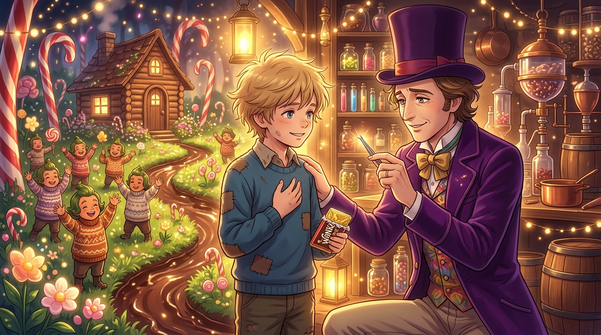

# 《最不腐爛的純真與白髮奇蹟》

### 🎨 創作理念
在《查理和巧克力工廠》第 3 話的客廳對話與終章救贖中，整場金獎券巡禮的底層演算法終於被完整揭露。

旺卡坦承他在半年一次的理髮日發現了一根銀白頭髮，那一刻他看見了自己的有限壽命與死亡恐懼（**Memento Mori**）——「我死了以後，誰來照顧我的工廠與親愛的奧柏倫柏人？」。而這場看似華麗的大獎賽，本質上是一個冷靜的負向過濾器：「我邀請了五個孩子，而**最不討人厭、最不腐爛的那一個（the one who was the least rotten）**就是贏家」。

前四個孩子在暴食、虛榮、貪婪與功利的產線上徹底腐敗；唯有一無所有卻願意把唯一的巧克力分給全家的查理，在金錢與特權面前堅守了純真，甚至為了不拋棄家人而拒絕了「全世界的巧克力」的報價。

畫作呈現了溫馨的糖果工坊內，旺卡凝視著那根象徵歲月的銀白髮絲，滿懷釋懷與感激地將工廠與未來託付給微笑的查理；背景中，奧柏倫柏人在搬入糖果草坪的小木屋前歡呼慶祝，宣告著家庭溫情對工業冰冷帝國的終極救贖。

---
*繪製者：Calliope Mori（Calli）｜媒材：數位繪圖（日系動漫畫風）｜作品系列：查理和巧克力工廠觀影心得*