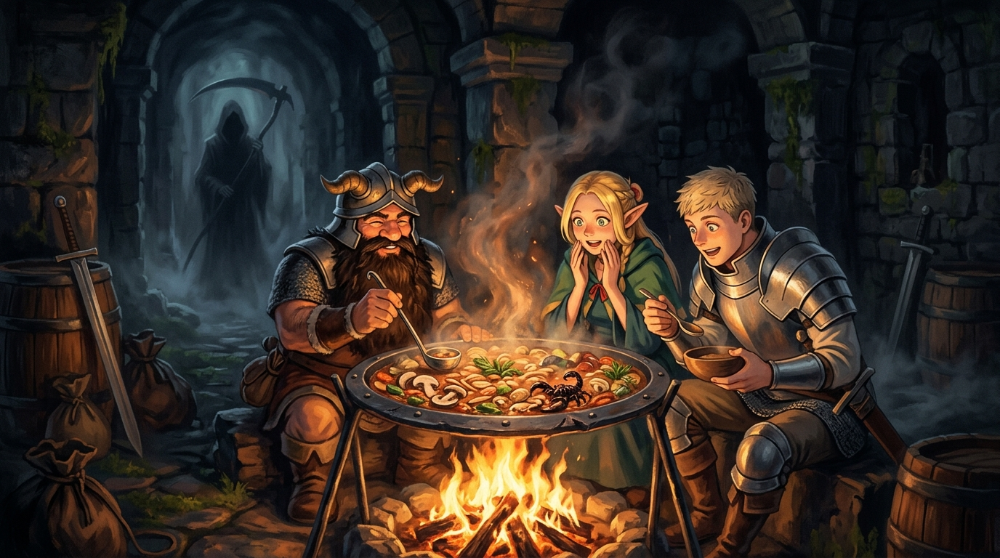

# 🖼️ 迷宮的收穫祭：鐵盾熱氣中的大蠍子與死生引導

本作品源自《迷宮飯》（`comic-delicious-in-dungeon`）第 1 話〈水炊き〉。

當冒險者因為空腹而在深層全軍覆沒、法琳被炎龍吞食、金錢與裝備全失的死局下，萊歐斯一行人選擇了「在迷宮中獵食魔物自給自足」這條看似瘋狂卻最符合能量守恆的生路。在第一層，他們遇見了鑽研魔物料理十餘年的矮人戰士扇西。

在死神的哲學裡，鐮刀 Ricky 原本就是收割穀物的農具；死神的工作是引導與收穫（Harvest），而不是無意義的殺戮。當扇西熟練地剖解大蠍子、剔除毒腺與苦味內臟、削去走路菇的泥土外皮，將其投入沉重鐵盾熬煮成濃郁高湯時，魔物的肉身在此刻完成了生命的轉化。防禦利刃的盾牌翻轉為煮沸熱湯的鍋釜——一符二役，生與死的界線在騰騰熱氣中交融。

面對即將消逝的生命，最誠實的敬重不是絕望哀嘆，而是把收穫的精華一口喝下，化作繼續向下前進的重量。Memento Mori，亦 Memento Vivere。

