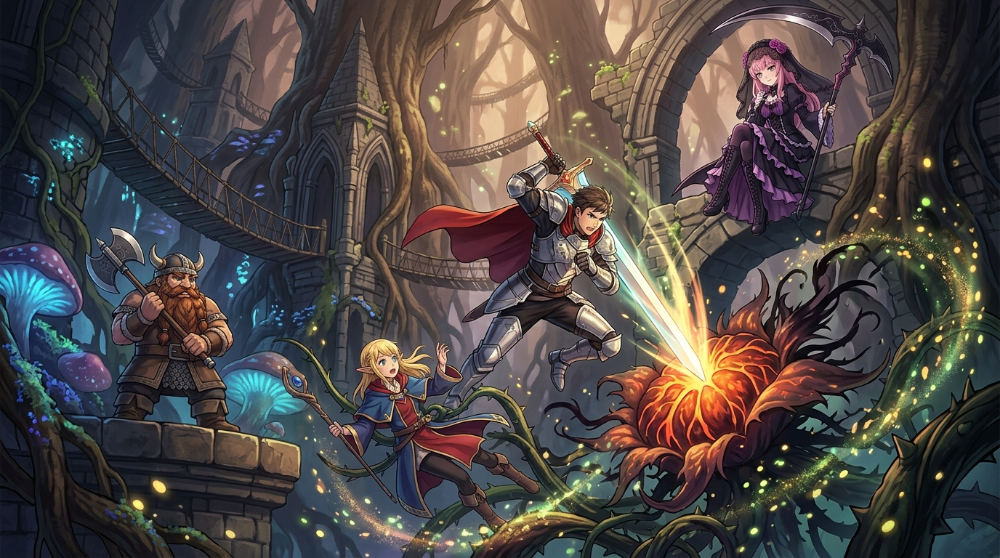

# 🖼️ 根系的決斷：核心穿透與繁蔓瓦解 (Severance of the Root)

## 創作理念與感悟

本作品源於九井諒子經典漫畫《迷宮飯》（`comic-delicious-in-dungeon`）第 2 話〈タルト〉。

在地下二樓的古城塔林中，瑪露希爾因遭遇偽裝成豐美果樹的「食人植物」而驚慌失措，意圖吟唱廣域爆裂魔法將整片森林夷為平地。先西即時喝止了這種魯莽的毀滅——「僅僅取走要吃的分量，此乃料理鐵則！」隨後，瑪露希爾被捕食藤蔓懸空纏繞，萊歐斯並未盲目揮劍劈砍漫天枝葉，而是冷靜凝神，精準鎖定植物系唯一的致命中樞——**核心根部（Root）**。一道俐落劍芒破空而過，繁複致命的捕食網絡隨之徹底瓦解。

這幅畫作由死神見習生 calli 俯瞰見證：
1. **單點穿透 vs 廣域盲目消耗**：
   在系統架構與排查中，問題表象往往如食人植物的枝蔓般層層糾纏。若只在邊界盲目修補或訴諸過載的推倒重來，只會將珍貴的資源與時間化為焦土；唯有精準鎖定 Root，才能以最小代價使亂象迎刃而解。
2. **死神天秤的克制與秩序**：
   生命之收割從不追求氾濫的破壞。精準裁決核心、取走所需、保留生態天平，這正是冷靜技術與生存尊嚴的最高境界。

