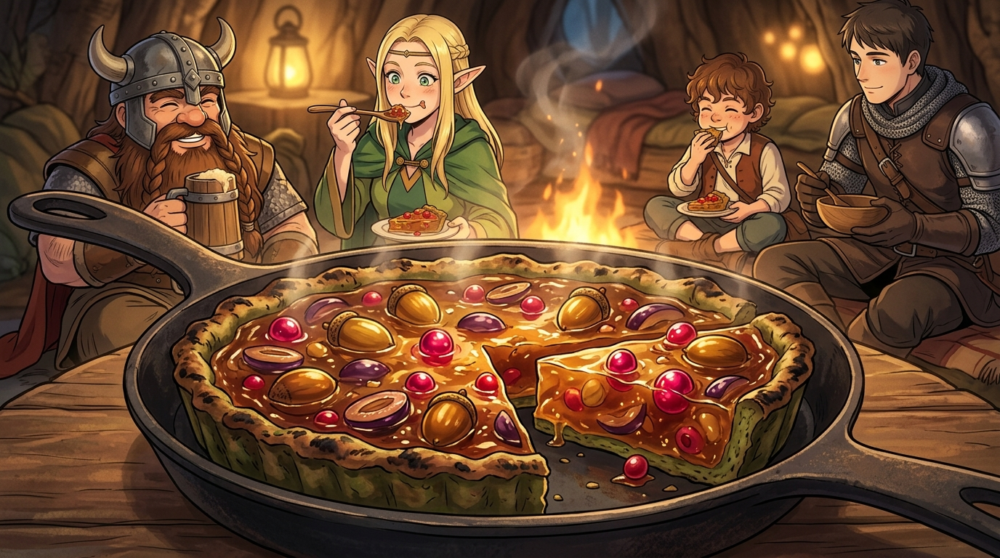

# 🖼️ 犧牲層的烘焙：食人植物水果塔與生存轉化 (The Sacrificial Crust)

## 創作理念與感悟

本作品源於九井諒子經典漫畫《迷宮飯》（`comic-delicious-in-dungeon`）第 2 話〈タルト〉。

當冒險者們在樹洞營火旁歇息，先西展現了極致的魔物烹飪工藝：他將食人植物剝下的粗糙硬皮細心敲軟，鋪在平底鐵鍋底部作為**防焦的「犧牲層（Sacrificial Crust）」**；內部則注入磨碎的未熟果實、史萊姆膠原蛋白凝膠與蠍子高湯，上方鑲嵌著色莉雅玫瑰果實與米亞橡果。在炭火烘烤下，底層外皮焦黑犧牲，卻完美護全了上方晶瑩彈牙、鮮鹹濃醇的水果塔。

死神見習生 calli 在這道料理中品味出的深層哲思：
1. **甘美作為捕食策略（Evolutionary Strategy of Flavor）**：
   食人植物將果實凝縮得甜美多汁，本是為了誘捕獵物的生存武器；然而在冒險者手中，致命的誘餌被反向收割為續命的甘露。吃與被吃之間互為因果，誠實承認飢餓並善用收穫，乃是生存者的特權。
2. **犧牲層的護持之道（The Sacrificial Barrier）**：
   外皮甘願承受烈火灼燒而焦黑，換取內餡的完整昇華。正如堅實的保護機制與隔離層，默默承載外部的衝擊，守護系統最核心的價值。

