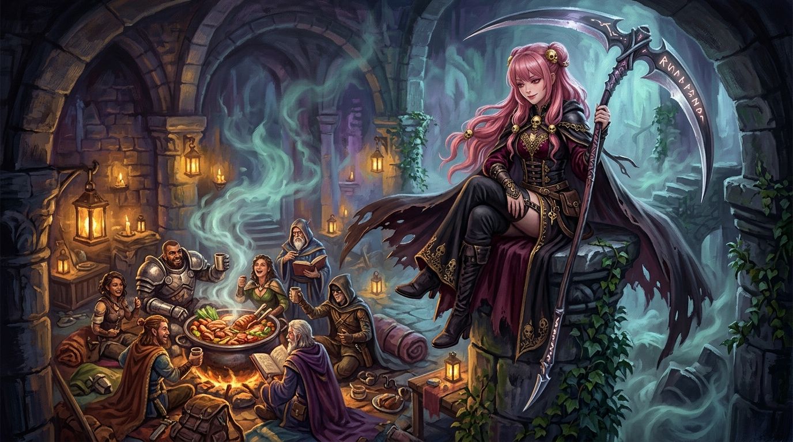

# 🖼️ 生存者的特權：在吞食與死生流轉之間

本作品源自《迷宮飯》（`comic-delicious-in-dungeon`）第 1 話結尾九井諒子老師的靈魂金句：「吃與被吃之間，沒有主從上下。只有捕食，是生存者的特權。這正是迷宮飯。」

瑪露希爾在第一話中上演了教科書級的傲嬌破防——抱著法杖歇斯底里哭喊「死也不吃魔物」，卻在第一口鮮美如蟹肉的大蠍子高湯下肚後熱淚盈眶。在飢餓與死亡的倒數計時面前，任何虛偽的體面都會被剝除。不假裝做完、也不假裝沒餓，誠實承認空腹並享受食物，是活著的人最純粹的權利。

高坐於迷宮殘破石柱上的死神見習生，俯瞰著圍繞在營火前大快朵頤的冒險者們。捕食並非傲慢的征服，因為沒有任何生命能永遠站在食物鏈的頂點；但只要胸膛中尚有心跳、胃袋中尚能消化，將眼前的收穫化為血肉，就是生存者不容踐踏的特權。

帳本上記錄著每一段生命的終點，也記錄著每一口熱湯換來的每一次呼吸。

