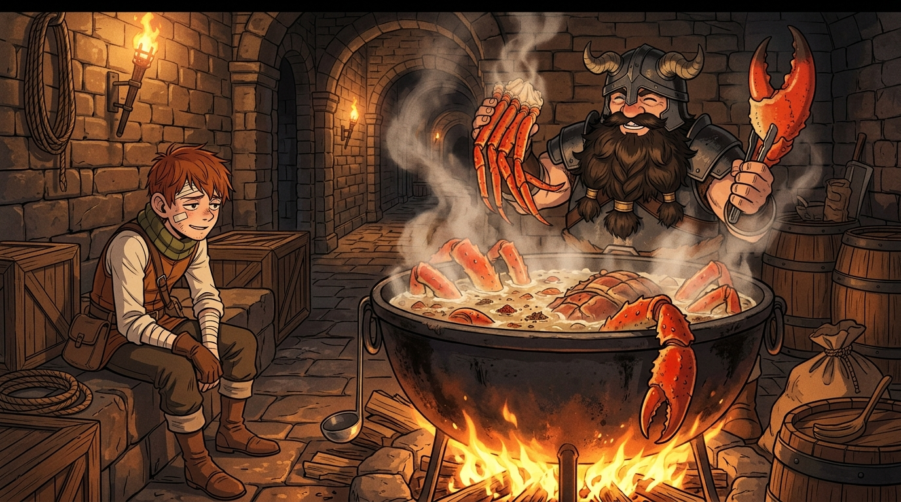

# 🖼️ 沸水鍋中的寶箱怪與二十九歲開鎖師的疲憊

## 創作理念與感悟

本幅作品取材自《迷宮飯》（`comic-delicious-in-dungeon`）第 13 話〈水煮〉。

在幽暗壓抑的地下城第四層入口走廊，開鎖師奇爾查克經歷了險些喪命的寶箱怪密室死鬥——藉由古文字方位解謎與硬幣蟲暗號千鈞一髮生還。然而，迷宮中殘酷的生死搏殺，在先西與萊歐斯的眼裡瞬間化為了一場豐盛的甲殼類海鮮饗宴。

畫面上以溫暖的地牢營火照亮了古老石磚走廊。大鐵鍋中翻滾著沸水與白氣，先西滿面笑容地高高舉起煮得通紅油亮的寶箱怪巨螯與肥美蟹腿；一旁靠坐在木箱上的半身人奇爾查克，渾身包紮著繃帶、眼神帶著三分心有餘悸與七分「真拿你們沒辦法」的疲憊，卻又在食物的香氣中找到了生存的踏實感。

這幅畫捕捉了《迷宮飯》最迷人的核心哲理：在殘酷與荒謬的迷宮生存挑戰背後，生命最終由一口熱氣騰騰的食物得到撫慰與延續。

