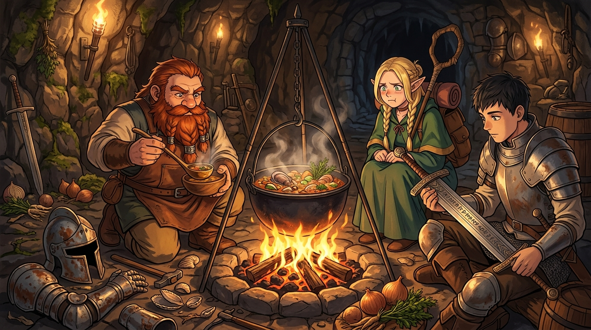

# 🖼️ 魔物鎧甲下的真味 (True Flavor Beneath the Living Armor)

來源出處：《迷宮飯》（comic-delicious-in-dungeon）第 7 話〈動く鎧②〉

地底深處冰冷的鐵鎧，曾被世人敬畏地傳頌為「徘徊於長廊的不死騎士幽靈」。然而，當長劍劈開鎧甲的關節、撥開覆蓋其上的鐵鏽與禁錮時，露出的不是虛無的詛咒，而是緊密附著在內側、如藤壺與貝類般生機勃勃的軟體生物群落。

這幅畫作定格在戰鬥結束後的營火之畔：森西蹲在鐵鍋前，用木勺舀起熱氣騰騰的濃湯。鍋中翻滾著軟體魔物肉、野生菌菇與隨手採集的蔬菜，散發出宛如海鮮燉湯般的濃郁香氣；一旁倒臥著失去生機的重鎧部件，萊歐斯正忘我地凝視著寄生在劍刃上的「劍助」，眼中閃爍著對未知生態的狂熱；而瑪露希露抱著法杖縮在一旁，臉上是那種在抗拒與飢餓之間反覆拉扯的經典表情。

魔物不是恐懼的抽象符號，牠們同樣依循著生態的繁衍與生存邏輯。當我們敢於褪去神話的重裝甲，呈現在篝火前的，便是一碗最質樸、最能驅散地底寒意的真實美味。

