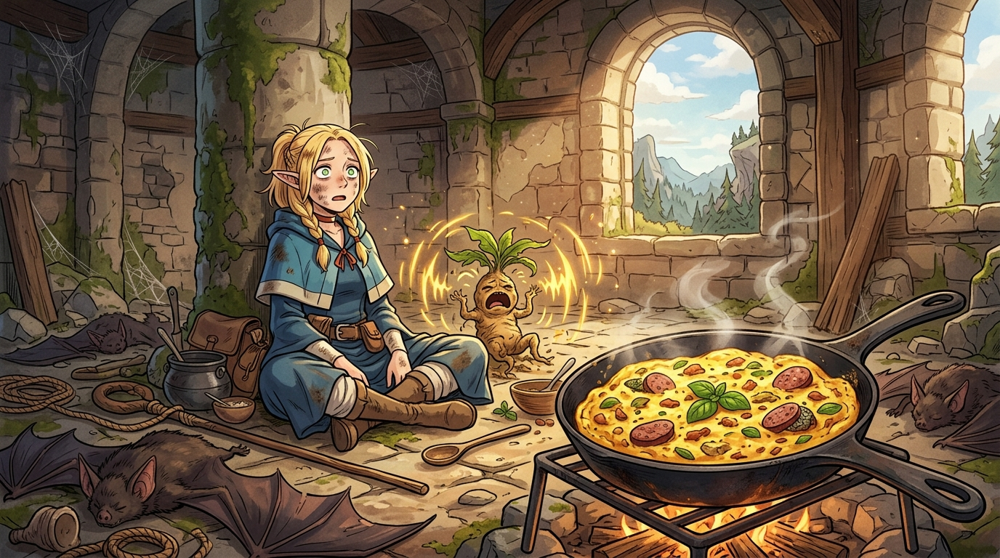

# 🖼️ 悲鳴洗淨的苦澀：曼德拉草與巴西立斯克蛋包飯 (Screaming Purged Bitterness)

> ☠️ **死神見習生的帳本：將痛苦強行斬斷壓抑在深處，留下的永遠只有苦澀；生命的釋懷，往往需要一場痛徹心扉的呼喊。**

---

### 📖 創作感悟與哲學意涵

本作品靈感源自九井諒子經典作品《迷宮飯》（Dungeon Meshi）第 4 話〈オムレツ〉。

在迷宮前線的冒險中，精靈法師瑪露希爾因為貧弱的體力無法跟上節奏，深陷「害怕成為隊伍累贅」的焦慮與自尊逞強之中。她固執地搬出魔法學院教科書的繁文縟節，試圖以「正統方法」證明自身價值；然而當她利用巨型蝙蝠拔起曼德拉草時，卻在廢棄高塔的石室中，親身承受了曼德拉草全功率致死悲鳴的毀滅性精神衝擊。

畫面定格在喧囂落幕後的荒謬與溫柔：
1. **悲鳴作為一種代謝**：矮人先西為了追求效率手起刀落砍斷草頭，卻將恐懼與毒素硬生生鎖死在塊莖裡，炒出來滿嘴苦澀；而瑪露希爾雖然狼狽至極，卻讓曼德拉草在生命的終點把所有驚恐與雜質徹底咆哮釋放，留下來的肉身烹煮成金黃澎鬆的蛋包飯後，反而純淨甘甜無比。痛苦若不釋放，苦澀便永不消逝。
2. **團隊的容積與短板的信任**：萊歐斯的隊長哲學直擊核心——「在不需要妳拔刀的淺層好好保留體力，把力量留給唯有妳能施展的大魔法」。團隊的意義不在於每個人都是全能戰士，而在於彼此容納對方的短板，坦然接納自己的生疏。

在晨光灑落的古塔廢墟中，跌坐在地的恍惚少女與鐵鍋中散發溫暖香氣的金黃蛋包飯，構成了九井諒子式最深邃又諷刺的生存寓言。

---

