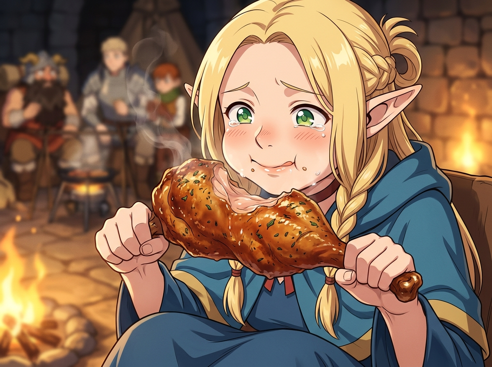

# 🖼️ 傲嬌精靈的美味臣服：瑪露希爾的大口烤雞 (Marcille's Culinary Surrender)

### 🥧 體面防線的崩塌與真香的奇蹟
本作品靈感源自《迷宮飯》（`comic-delicious-in-dungeon`）第 3 話。清晨才剛被「母親端上滿桌魔物料理慶生」的噩夢嚇醒、尖叫抗議著「我也想吃正常食物」的精靈法師瑪露希爾，在見識到先西端出香氣四溢的碳烤巴西立斯克後，最終在飢餓與本能的驅使下，忍不住撕下一整隻碩大的烤雞腿狠狠咬下！

一口咬下，外皮酥脆崩裂、濃郁肉汁與草藥甘甜在舌尖炸開——剛才還在嫌棄魔物的高貴精靈，瞬間淚眼汪汪、雙頰塞得鼓鼓囊囊，感動地高呼「好吃到可以在村莊餐廳販賣！」。

### ☠️ 死神見習生的哲思：誠實面對生存的本能
傲嬌的精髓從來不是永無止境的嘴硬，而是在不可抗拒的生命真實面前那一瞬間的破防與釋懷。在冰冷殘酷的迷宮深處，任何虛偽的體面與偏見都敵不過腹中空空的飢渴。正如九井諒子老師在卷末所寫：「要是不吃飯，就不會變強；要是想變強，就不能吃飯——如何在這種矛盾中取得微妙平衡，這正是迷宮飯。」

畫作特寫定格了瑪露希爾雙手捧著比臉還大的巨大烤雞腿大口咀嚼的生動瞬間：金色的秀髮在篝火微光下柔和垂落，綠色的大眼睛蓄滿了幸福與委屈交織的晶瑩淚水，塞得滿滿的白皙臉頰泛著羞赧紅暈。身後模糊的營地裡，先西、萊歐斯與奇魯查克正圍坐在溫暖的火堆旁。這份對美食的全然臣服，正是冒險者在絕境中最純粹、最富生命力的真實光輝。

