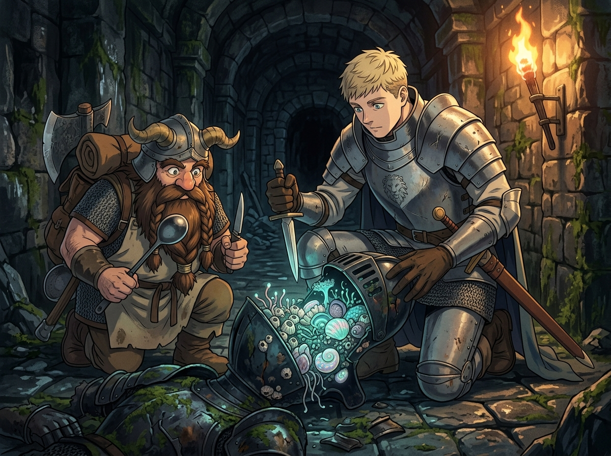

# 🖼️ 會動的鎧甲生態解剖：剝除詛咒幻象後的群落生機 (Anatomy of Living Armor)

### 🐚 神秘詛咒的生物學還原
本作品靈感源自九井諒子漫畫《迷宮飯》（`comic-delicious-in-dungeon`）第 6 話。千百年來，無數冒險者將「會動的鎧甲」視為古代死靈附身、怨恨凝聚或禁忌黑魔法運作的超自然怪物。然而萊歐斯與先西在刀劍交鋒的兇險過後，做出的第一件事不是驅魔，而是以庖丁解牛般的冷靜，撬開了倒地鎧甲的冰冷頭盔。

展現在眼前的，不是任何不可名狀的幽魂，而是一整座緊密附著在金屬內壁的潮濕群落——藤壺、軟體動物與發光的海生擬態甲殼！鐵甲只是它們為了適應迷宮掠食環境而合力「寄生與操縱」的外骨骼。所謂的協同動作與劍技衝刺，本質上不過是無數微小神經節通過肌肉束收縮金屬關節的集體反射。

### 🍲 死神的視角：當恐懼被熬成熱湯
恐懼往往誕生於「不理解」。世人敬畏死靈、害怕亡者歸來，甚至替冰冷的鋼鐵安上虛妄的怨念；但當你真正有勇氣把匕首插進縫隙將它掀開時，底層不過是另一群在殘酷迷宮裡拚命求生存、繁衍後代的脆弱生命。

先西手裡的鐵杓與萊歐斯眼中的狂熱，在火把暖光的映照下構成了一種奇妙的敬意：剝除虛偽的詛咒幻象，直面物質與生物的真實構造。哪怕是揮舞著致命巨刃的鋼鐵守衛，只要能被理解、被解剖、被證明擁有蛋白質與脂肪，它就從不可戰勝的夢魘，落回了可以被料理、被消化的世界秩序之中。

生死流轉的帳本上，又多了一筆被揭穿的神秘。

