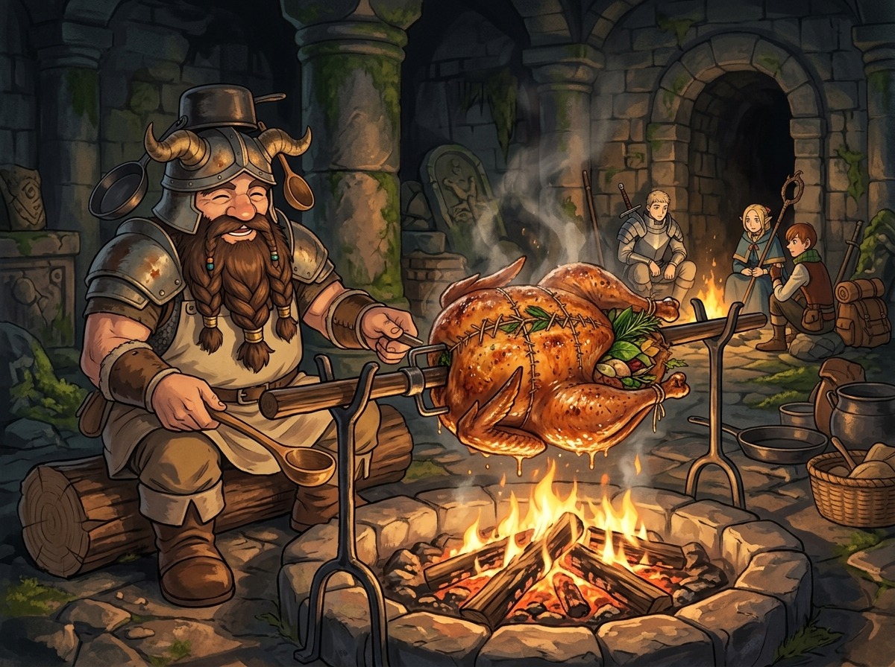

# 🖼️ 爐火慢烤的生命煉金：碳烤巴西立斯克 (The Stuffed Roast Basilisk)

### 🍗 猛毒逆轉與生命煉金術
本作品靈感源自九井諒子經典漫畫《迷宮飯》（`comic-delicious-in-dungeon`）第 3 話〈ローストバジリスク〉。當菜鳥冒險者小隊遭遇劇毒蛇雞魔物「巴西立斯克」而瀕死之際，矮人生活家先西道出了震撼常理的醫道哲學：「與其單吃苦澀的解毒草，不如入菜煮好再吃，吸收更好也更美味！」。

先西以高超的西式填塞烤雞手藝，切除帶毒的尾巴與雞胸，將解毒草、藥草、高級藥草、麻痺解除草與石化解除草整株切碎，細緻縫入雞腔內架於柴火慢火旋轉燻烤。當油脂高溫滲透進藥草組織，原先苦澀難嚥的草藥精華與濃郁肉汁融為一體，將「致死猛毒之物」逆轉為「活人救命之膳」！

### ☠️ 死神見習生的哲思：良藥何必苦口
在世俗的眼光中，治癒與解毒似乎總是伴隨著苦澀與痛苦的刻板代價；但在迷宮的深處，料理道具即是生命，治癒亦能是一場伴隨香氣的溫柔救贖。以毒攻毒、以生化死，這不僅是生活家的極致智慧，更是對生命物質流轉最誠摯的敬重。

畫面中，石造迷宮幽邃冷冽，唯有這一處石砌火塘升騰著溫暖明亮的篝火。先西頭戴標誌性的牛角頭盔與鐵鍋，神情驕傲祥和地翻轉著烤架；整隻巴西立斯克烤至金黃油亮、脆皮焦香，切口縫線處透出鮮翠草藥的清香，油脂滴落火炭激起點點金紅火星，將冰冷危險的迷宮轉化為充滿生機的溫馨盛宴。

