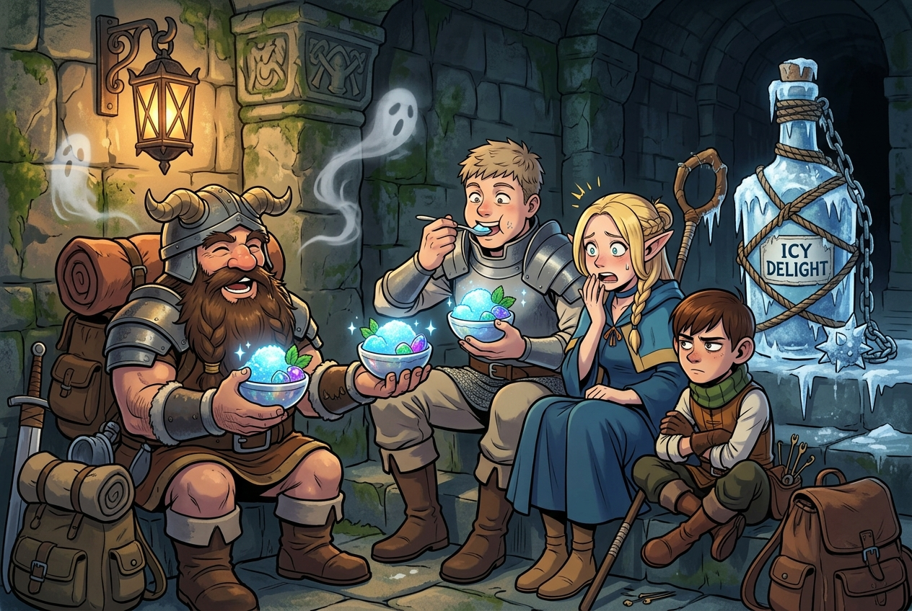

# 🖼️ 消災解厄！除靈雪酪 (Exorcism Sorbet: Chilled by the Ethereal Cold)

### 創作理念與感悟

本幅作品取材自九井諒子經典漫畫《迷宮飯》（`comic-delicious-in-dungeon`）第 11 話〈雪酪〉。

在缺乏聖職者法琳慈悲超渡的險境中，陰風呼嘯、死靈群聚。然而先西卻展現了令人拍案叫絕的荒誕神技——他掏出蠟燭、神聖象徵、象徵太陽的糞金龜（寶物蟲果醬）、殺菌的利口酒、淨身的鹽糖與史萊姆膽，熬煮出一罐熱量拉滿的「特製無國界風聖水」。更神來之筆的是，他用繩索將瓶身死死纏緊，反手製成了一柄「聖水流星錘」！

這根本不是神學儀式，而是一場純粹的**熱力學物理實驗**。當死靈穿透高速揮舞的流星錘時，陰氣帶走巨量熱能，厚厚的霜層在瓶身結起，直接將內部的糖水與利口酒急速冷凍為口感細膩、清爽消災的「除靈雪酪（Sorbet）」。

起初無比嫌棄的隊友們，在第一口冰涼送入嘴中時瞬間眼神發亮「真香」狂吃。這正是地下城最硬核的 Memento Mori 哲學：世人恐懼逃避的死亡與怨念，只要懂得其物理機制與生命熱量轉換，哪怕是陰森死靈也能化作滋養生者的甘甜 Harvest！

