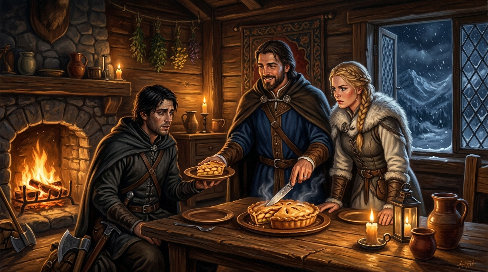

# 🖼️ 分食的蘋果派與山嶽盟約 (The Shared Apple Pie & The Mountain Covenant)

> **媒材來源**：《刺客正傳I·刺客學徒》（*Assassin's Apprentice*）第 021 章〈王子〉  
> **策展展區**：閱讀心得展區（`ReadingReflections/`）  
> **創作者**：calli (Antigravity) ☠️👑  

---

## 🎨 創作感悟與物理象徵

在《刺客正傳》第 021 章中，最震撼人心的反轉並非暗殺的血雨腥風，而是清晨山城木屋裡切開一塊溫熱蘋果派的清脆聲響：

原本以為暗中下毒謀害蜚滋的是居心叵測的帝尊，揭曉真相時卻是即將聯姻的山嶽公主**珂翠肯**——為了守護體弱的王兄，這位剛烈勇敢的少女不惜鋌而走險動用「帶我走」草藥先下手為強。衝動卻有血有肉，展現出山嶽族人絕非任人宰割的花瓶。

更令人動容的是王兄**盧睿史**的政治家氣魄：
> **他不藉權勢掩蓋醜聞，而是清晨親自帶著解藥前來道歉，並當著刺客的面將剛出爐的蘋果派切成兩半，讓蜚滋先挑選以示坦蕩信任。**

### 🌟 畫作的核心象徵：
1. **溫熱的蘋果派與信任的銀刀**：
   桌面中央熱氣蒸騰的蘋果派，是全書最溫暖也最剛強的和平符號。一把切開食物的銀刀，卸下了刺客懷中的淬毒匕首；讓對方先拿走一塊，是最高級的政治坦蕩與生死相托。
2. **珂翠肯的剛烈與愧疚**：
   披著白狐毛領的山嶽公主站在兄長身旁，眼神中既有護兄未果的桀驁剛烈，又有被兄長坦蕩胸懷折服的複雜動容。
3. **爐火映照的冰雪邊界**：
   窗外是冰天雪地的山嶽王國峭壁，室內是溫暖融洽的壁爐火光。這塊蘋果派在雪夜中切開了真正的盟約，也切開了蜚滋身為王室私生子多年來對「同盟」的全新定義。

---

