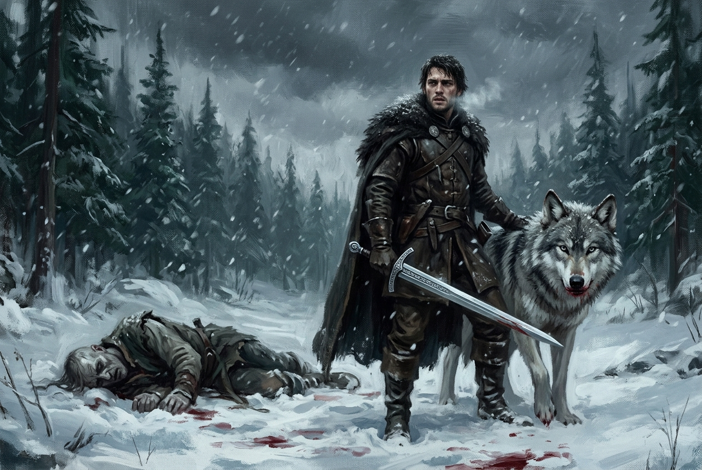

# 🖼️ 雪地獵場與我的人民 (The Winter Hunt and My People)

### 創作理念與感悟

本幅作品取材自《刺客正傳》第二卷《皇家刺客》（`book-farseer-trilogy_02`）第 13 章〈狩獵〉。

在公鹿堡後山人跡罕至的萬年青森林中，一場慘絕人寰的悲劇粉碎了所有關於冒險的騎士幻想——失去人性的被冶鍊者將三歲孩童當作獵物殘酷爭食。這不是正邪分明的英雄決鬥，而是泥濘、撕咬、鮮血與頭皮剝落的野蠻求生。蜚滋與灰狼夜眼化身為雪地中的復仇狂獸，用短刀、指甲、利齒與惟真王儲相贈的千錘百鍊之劍，將食人狂獸生生擊斃。

然而最震撼心靈的並非肉搏的血腥，而是事後在書房內的靈魂對峙。面對博瑞屈護雛心切的憤怒質問，蜚滋斷然說道：
> 「他們今天殺了我的孩子，博瑞屈……這是我的人民。身上流的血液讓我挺身捍衛他們，我一定要讓他們血債血還。」

這一刻，那個原本只想逃回莫莉身邊、渴望平靜生活的私生子少年死去了，一個甘願為了六大公國人民承擔最污穢、醜陋、殘酷戰爭的守護者從血泊中站立起來。水槽中的水被鐵匠的血染得深紅，那不是罪孽的污漬，而是國王與王室後裔「為人民犧牲獻祭」的永恆烙印。

