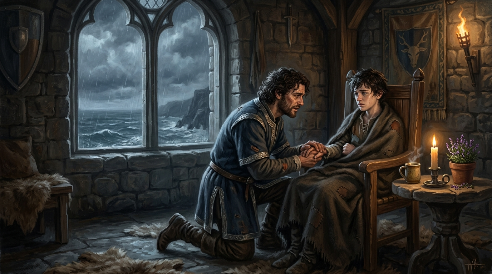

# 🖼️ 塔頂毛毯與君臣之名

這幅畫取自《刺客正傳》（book-farseer-trilogy_01）第十八章〈暗殺〉。

盛夏的公鹿堡塔樓頂端，暴雨伴隨著洶湧海浪拍打著高聳的石窗。惟真王子為了阻擋紅船劫匪侵襲海岸，日復一日在此燃燒骨髓施展精技，肉體枯槁得食不知味。十四歲的蜚滋被切德派來服侍王子，為他調製濃烈的精靈樹皮茶、在窗前擺上一盆盆盛開的百里香，並在危急關頭因一句發自內心的「我是吾王子民」而將自己的生命力獻給了惟真。

然而，當抽乾體力的蜚滋牙齒打顫、渾身發抖癱倒在石地板上時，惟真並未將其視為理所當然的消耗品。他驚悔萬分地及時收手，將少年輕輕抱起放在自己硬挺的高背木椅上，掖好羊毛毯，跪在少年身旁遞上冒著熱氣的藥茶，並在狂風驟雨中以最真誠的聲音為他正名：

> **「蜚滋駿騎・瞻遠。這是你的名字，小子，是我親自寫在軍營紀錄上的……別再把你自己視為『那個私生子』了。」**

本小姐選擇凝結塔頂窗前的這一刻——窗外是冰冷呼嘯的狂風驟雨與翻騰怒海，室內則是燭火與百里香映照下的溫暖角落。形銷骨立卻眼神堅定率直的惟真王子半跪在木椅旁，握著裹在粗羊毛毯裡虛弱少年的手。這不僅是一次力量的交接，更是一份跨越私生子陰影的君臣誓約：真正的領袖不會把部下的犧牲當作無名耗材，而是將對方的名字親手刻進了王國的帳本之中。☠️✨

