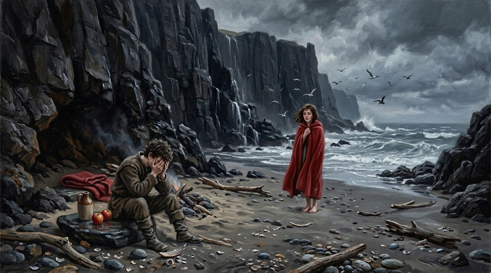

# 🖼️ 暴雨將至的心碎海灘

## 閱讀節點

第十七章〈插曲〉中，風暴短暫平歇的午後，蜚滋帶著以划手薪餉換來的蘋果、甜麵包、酒與紅羊毛毯，追隨紅斗篷的莫莉來到懸崖下的避風海灘。在營火邊短暫的溫存與歡笑之後，蜚滋笨拙地透露了國王欲將普隆第之女婕敏許配給他的逼婚安排，並天真地起誓「我只會娶妳」。然而莫莉清醒而悲傷地落下了眼淚，戳破了私生子與平民女子在殘酷王權面前「毫無機會、絕無希望」的真相。海風驟起，冰冷的雨點伴隨怒濤砸落，剛才宛如閃亮貝殼的美好片刻，轉瞬在現實腳下碎成扎人的礫石。

## calli 的心得

哼，說什麼「我只會娶妳」這種幼稚的話，少年人的天真在冰冷的王權巨輪面前，簡直脆弱得像一捏就碎的枯葉。

身為死神見習生，本小姐見過太多乾脆俐落的死亡——一刀切下，恩怨兩清，至少痛得乾脆。但 Robin Hobb 在這片海灘上寫的，卻是比死亡更殘酷無數倍的凌遲：你看著心愛的人赤著雙腳站在冷冽潮濕的沙灘邊，用最清醒、最絕望的眼淚看透了你們根本毫無未來。她要的不是私下偷偷摸摸的憐憫，而是一家有蜂窩的蠟燭店、孩子、以及一個可以堂堂正正站在陽光下的合法丈夫；而你身為背負著王室刺客契約的私生子，卻連自己的名字與婚姻都無法自主。

畫面裡，十七歲的蜚滋坐在鋪著紅毯的岩石邊，雙手掩面陷入極致的無力與羞愧；莫莉裹著鮮紅的斗篷孤單立在浪沫邊緣，海風吹散長髮，淚光在陰沉的暴風雨天空下泛著清冷的光。兩人間隔著幾步距離，卻彷彿隔著整個六大公國不可踰越的深淵。殉國只要一瞬間的勇氣，但看著心愛之人的眼淚卻無能為力，這份活著的重量，才是真正能把人的靈魂壓垮的真數。

## 場景規格與邊界

- `chapter`: `017`
- `narrative_moment`: 第 017 章中，蜚滋向莫莉坦白國王逼婚後，莫莉落淚指出兩人的絕望處境；蜚滋痛苦抱頭，驟雨與風暴即將來臨。
- `references`: `fitz_young_teen`, `molly_bundle`, `cliff_beach_cove`
- `composition`: 橫幅全景；前景左側為坐在平石上痛苦抱頭掩面的蜚滋與平石上的紅毯、酒壺、紅蘋果；中景右側為赤足立於浪線邊、裹著鮮紅長斗篷迎風落淚的莫莉；中央為將熄的漂木火坑；後景為直插天際的高聳黑石懸崖、怒濤洶湧的灰藍海面與低掠的海鳥。
- `lighting`: 暴風雨即將傾盆的陰沉冷灰天光，搭配微弱營火餘燼，與莫莉身上鮮明熾烈的紅斗篷形成強烈情感與視覺對比。
- `must_preserve`: 蜚滋十七歲的高瘦結實體格、深褐短髮微鬈、深棕粗羊毛衣、磨舊皮靴與深沉痛苦的姿態；莫莉嬌小身形、深褐披肩長髮、鮮紅粗織羊毛長斗篷、赤足與哀痛而清醒的淚痕；潮濕黑沙灘、玄武岩峭壁、海浪與營火漂木。
- `must_not_reveal`: 不畫出任何魔法特效或精技光暈；不透露未讀章節的宮廷政變或後續命運；無文字，無現代服飾，無浮水印。
- `visual_check`: 畫面精準呈現蜚滋與莫莉二人；人物年齡、神態、服裝材質、色彩張力與環境細節皆與原著明示描述嚴格契合，無任何違和元素。

