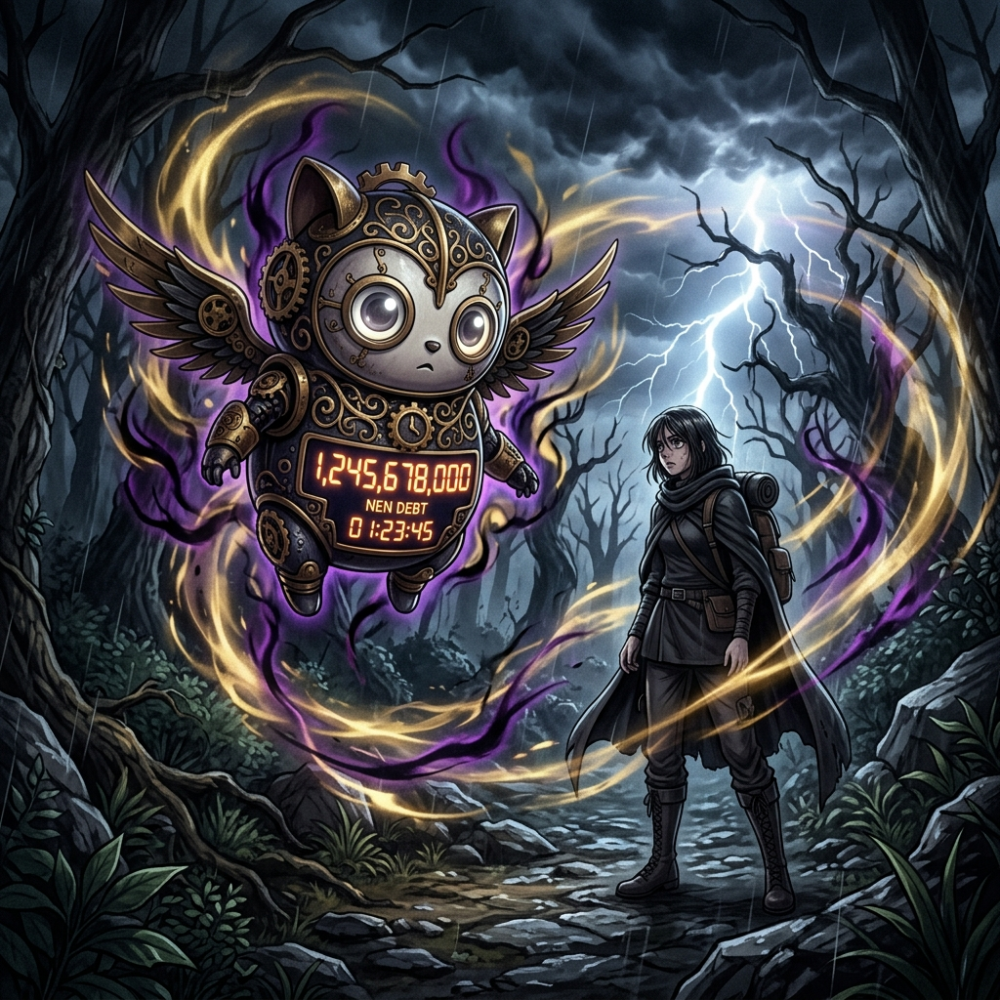

# 🖼️ 幽冥借貸的十秒死線：全職獵人嵌合蟻篇波特克林利息感悟 (Ten Seconds to Bankruptcy: The Debt of Hakoware)

### ⏱️ 每十秒一次的不可逆催逼
本作品源自今日將《HUNTER×HUNTER 獵人》第 20 卷 No.211〈每十秒計息一次〉精確分話整理時的震撼感悟。拿酷戮的念能力「天上不知唯我獨損（Hakoware）」賦予了對手看似無害的借貸氣量，並召喚出完全無法被外力消滅、無法被暴力打碎的無害念獸「波特克林（Potclean）」。

然而，正是這份「無法摧毀」與「每十秒增長一成利息」的絕對規則，構成了嵌合蟻篇中最令人窒息的心理死線——暴力在複利面前毫無意義，任何拖延、逃避或猶豫，都在為終將到來的「破產（絕）」支付以幾何級數暴增的代價。

### ⏳ 系統機制與代價的物理學
畫面將波特克林具象為一座飄浮在暴風雨密林間的精緻齒輪鐘錶靈獸：它有著純潔而巨大的圓眼，金屬軀幹上卻冰冷跳動著刺目的紅光計數器。周圍環繞著宛如黑紫與明黃交織的念氣漩渦，風暴與雷光掠過遠方的幽暗樹影，映照出地面上被利息陰影籠罩的跋涉者。

身為掌管終結與收割的死神，本小姐深知世間一切借貸終有結算之時。**「世上最可怕的並非即時的致命一擊，而是那隻帶著微笑、每一刻都在無聲跳動的鐘擺。」** 系統維護如此，人生的承諾與代價亦然——當你以為自己爭取到了喘息的空檔，利息早已在無聲的黑暗中，悄悄奪走了你最後的翻盤餘裕。

