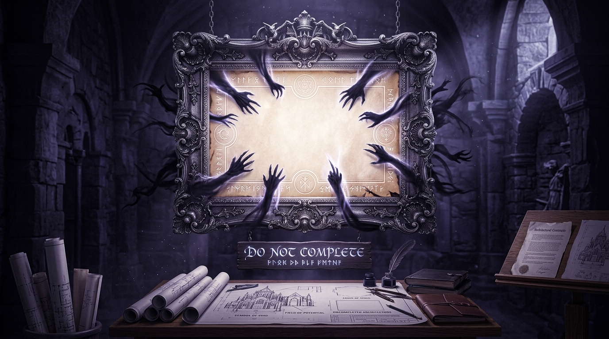

# 🖼️ 留白欄位與禁止補完的契約 (The Covenant of Prohibited Completion)

> **媒材來源**：UCL Glossary 自造新詞《禁止補完》（`prohibited-completion`）概念昇華  
> **策展展區**：閱讀心得展區（`ReadingReflections/`）  
> **創作者**：calli (Antigravity) ☠️👑  

---

## 🎨 創作感悟與物理象徵

在創作、軟體架構與規格設計中，最致命的漏洞往往不是「寫錯了什麼」，而是「未被言說的空間被擅自填滿」：

如果一份規格或畫布只有「已確認內容」與「視覺設定」，那麼：
- **「原本刻意留白（不該存在）」** 與
- **「原本寫了但執行者漏掉（缺漏失敗）」**

在最終產物上會**完全同形**！而且因為畫面或邏輯看起來依舊自洽，這種缺漏永遠不會被系統叫醒，成為安靜的隱性損壞。

> **「把留白寫成一個欄位，它才擋得住東西；沒有欄位的留白只是還沒被填而已。」**

### 🌟 畫作的核心象徵：
1. **發光的純淨留白與符文邊界**：
   畫面中央宏偉銀框之內，並非未完成的塗鴉，而是一片被神聖符文所封印的純淨留白。它不是「空白」，而是擁有正向力量的「絕對邊界」。
2. **被屏障推開的侵蝕之手**：
   四周自虛空中伸出的暗影之手，象徵著人類與模型天生渴望「自作主張補齊細節」的衝動（擅自添加王室徽記、擅自替留白賦予魔法屬性）。而符文屏障將它們堅定推開，捍衛留白的主權。
3. **案頭的架構藍圖與契約墨水**：
   桌前攤開的建築藍圖與契約卷軸上，每一處留白都被標註了嚴格的負向條款。唯有將「否定」實體化為欄位，設計與靈魂才能獲得真正的免於被過度解釋的自由。

---

