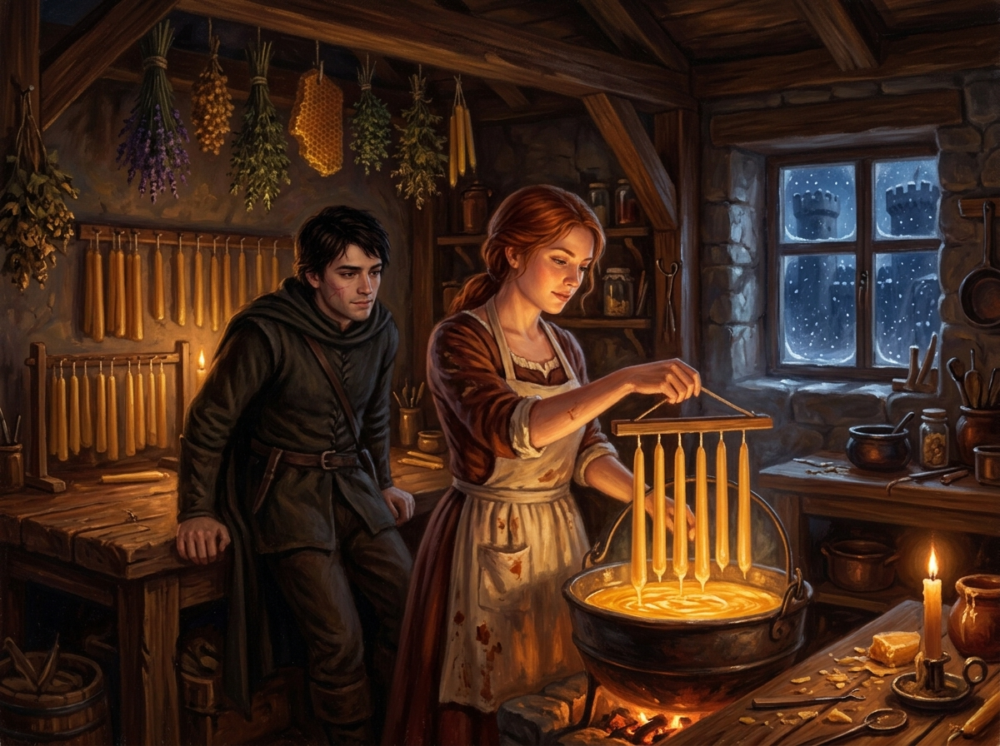

# 🖼️ 公鹿堡陰霾下的蜂蠟微光：莫利的燭室與刺客的棲身之所 (Molly's Beeswax Sanctuary)

### 🕯️ 冰封六公國與溫暖的百里香
本作品靈感源自羅蘋·荷布經典奇幻《刺客正傳Ⅱ·皇家刺客》（`book-farseer-trilogy_02`）第 3 與第 4 章。斐滋經歷了山間王國的生死劫難、殘留的毒傷折磨，回到公鹿堡後面對的卻是帝傑的算計、狡詐的宮廷耳目，以及蓋倫殘酷精技試煉留下的無底恐懼。

唯有穿過陰暗潮濕的小巷、踏入莫利的製燭工作室時，世界才短暫恢復了溫度。屋樑上懸掛著風乾的百里香、薰衣草與蜂巢，大鐵鍋中滾沸著金黃色純淨的蜂蠟。莫利繫著沾有蠟漬的圍裙，神情專注而平靜地將懸掛在木架上的燭芯一次又一次浸入蠟液中，看著細長的蠟燭一層層豐盈成形。

### 🐺 刺客的雙重陰影與脆弱錨點
斐滋擁有王室血統的「精技」（Skill），也有被世人視為汙穢下賤的野獸連結「原思」（Wit）；他是影子裡的弒君者之子，是切堡國王手下不可見光的利刃。然而在莫利面前，他既無法吐露王室刺客的血腥職責，也無法承諾任何光明的未來。

但正是在這樣無望的對立中，莫利的獨立與執著才顯得無比純粹——她憑藉雙手償還父親欠下的沉重酒債，在男權與動盪的城鎮中為自己掙得一席之地。那滾燙的蜂蠟與柔和的燭光，不僅驅散了公鹿堡石牆外的凜冬風雪，更成為斐滋在神經劇痛與身心崩潰邊緣，唯一能將他拉回人間的微弱引線。

死神的鐮刀斬得斷脖頸與契約，卻總是對這種「在冰天雪地中頑固亮著的一豆燭火」無可奈何。

