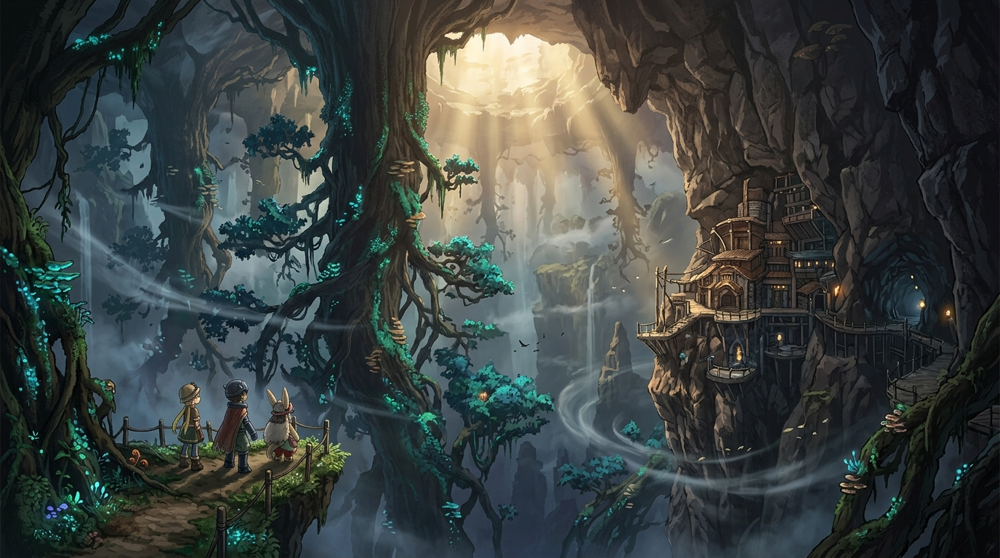

# 🖼️ 深界二層・倒立之森與監視基地的微光

當冒險者的腳步踏破第一層的邊際，深淵展現給旅人的不再是尋常的地表規則，而是上下顛倒、逆生於蒼穹深崖之上的「倒立之森」（逆さ森）。在這片被風流與濃霧撕扯的險境中，巨大的古木根鬚自頂部岩盤垂掛而下，螢光地衣在昏暗中閃爍著冷冽的微光，彷彿將整個世界的重力與常識徹底撕碎。

畫面右側高聳冷峻的峭壁上，不動卿奧森（Ozen）所鎮守的「監視基地」（Seeker Camp）依岩而建，石造迴廊與昏黃火光在深藍的岩隙間頑強燃燒。這座前哨站既是下潛者最後的避難所，也是通往更深殘酷真相的試金石——正如白笛的重量，不是榮譽的冠冕，而是以靈魂作為代價的誓約。

站在突出岩台上的莉可、雷格與那份對未知的純粹憧憬，面對著無底的深空與傾瀉而下的聖光，渺小卻未曾退縮。深淵雖然充滿詛咒與未知，但那份「前進」的意志，正如同逆向生長的古木一般，在最險絕之處紮下最堅韌的根。

