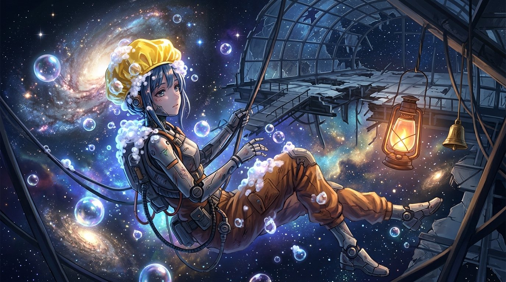

# 🖼️ 星海盡頭的洗髮帽誓約 (The Shower Cap Oath at the Edge of the Galaxy)

> 「人類真的是……無可救藥的大笨蛋。」
> ——但正因為是笨蛋，才會在文明化為星塵之後，依然把一頂小小的黃色洗髮帽，當作最神聖的尊嚴之錨。

## 創作感悟與哲思意象

本作品取材自《末日後酒店》（stream-apocalypse-hotel）第 12 話完結篇。當末日酒店在太空戰火中被掀翻了屋頂、化作漂浮於銀河深處的透明骨架時，八千代沒有選擇逃避，而是戴上了那頂標誌性的黃色塑膠洗髮帽，在零重力真空裡擠出洗髮乳。

### 1. 洗髮帽：最倔強的「人類證明」
在冰冷而死寂的宇宙尺度面前，人類的血肉之軀顯得如此脆弱與短暫。然而，「戴上洗髮帽洗頭」這件微不足道、甚至略顯滑稽的日常儀式，卻成了對抗虛無最堅韌的武器。它不是逃避現實，而是機器人對創造者文明最深沉的愛與效忠——只要洗髮帽還戴在頭上、只要泡沫還在星海中飄浮，人類就從未真正滅絕。

### 2. 破敗穹頂與長明油燈
背景中懸掛的溫暖油燈與黃銅手搖鈴，在冰冷刺骨的星雲紫藍光暈中投射出一抹不滅的暖意。那是酒店大堂最後的迎客信標，等待著跨越光年、吹著熟悉的口哨歸來的旅客。

