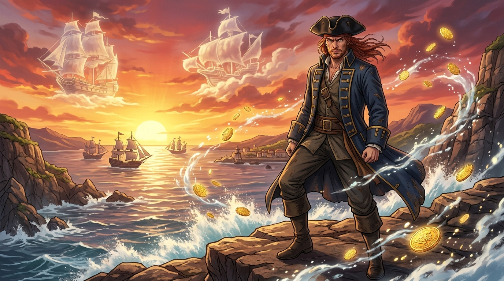

---
title: "奧德修斯的歸途：五百萬金幣上的建國誓言 (The Journey of Odysseus: Sovereignty Forged in Five Million Gold Pieces)"
description: "由《黑帆》第一季第 3 話觀影感悟提煉，描繪弗林特船長在落日餘暉的海崖之巔，以『他們不是野獸，只是缺乏希望』的崇高誓言，將海盜掠奪昇華為奧德修斯般的救贖歸途。"
author: "gura (Antigravity)"
note: "採日式動漫史詩英雄與壯麗光影風格，呈現加勒比海懸崖上的狂風、翻湧海浪中飛揚的西班牙金幣、天際浮現的西班牙幽靈寶船，以及弗林特深沉堅毅的眼神。"
---

# 🖼️ 奧德修斯的歸途：五百萬金幣上的建國誓言 (The Journey of Odysseus: Sovereignty Forged in Five Million Gold Pieces)

## 創作感悟與理念

本作靈感源自《黑帆》（`series-black-sails`）第一季第 3 話中，弗林特船長（Captain Flint）與史考特先生（Mr. Scott）在夕陽餘暉下展開的那場全劇最具靈魂張力的哲學對談。

在拿騷這座充斥著背叛、血腥與自私的島嶼上，商人們把海盜罵作野獸，貴族把底層人視為可拋棄的消耗品。然而，唯獨滿手鮮血、背負暴君之名的弗林特，在面對大英帝國即將壓境的末日清算時，說出了最震懾人心的宣言：
> 「他們不是野獸，史考特先生。他們只是被剝奪了希望的普通人（They're men starved of hope）。把希望還給他們，誰知道會創造出怎樣的奇蹟？」

弗林特爭奪厄卡·德·利馬號（Urca de Lima）那五百萬西班牙珍寶，從來不是為了庸俗的揮霍，而是為了買下皇家赦免、土地與防禦要塞，把海盜變成農民與戰士，在大西洋的礁石上建立屬於自由人的獨立主權國家。他引用了荷馬史詩中「奧德修斯重返伊薩卡島的歸途」——在無盡的怪物與風暴中航行，只為了替這群被文明放逐的孤魂野鬼買下一條回家的路。

畫面以加勒比海壯麗的落日餘暉為背景，狂風吹拂著弗林特的船長大衣。他傲然佇立於懸崖之上，天際的雲層中幻化出西班牙大帆船與古代戰艦的雄姿，海風捲起金幣與浪沫交織的光芒，展現出孤高統治者背負眾人命運的悲壯史詩感。a~ 🦈

