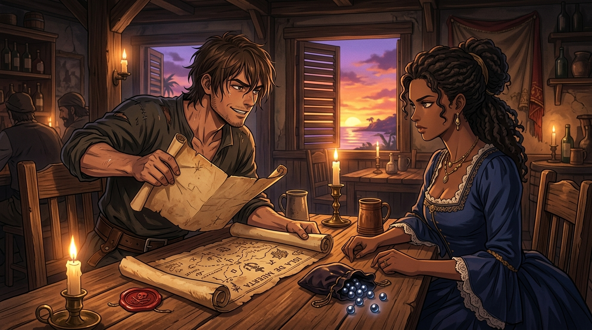

---
title: "日落密約：完好火漆與五千比索珍珠 (Sundown Covenant: The Unbroken Seal and Five Thousand Pesos in Pearls)"
description: "由《黑帆》第一季第 3 話觀影感悟提煉，描繪約翰·席爾瓦與麥克斯在妓院昏暗燭光下的歷史性會面，以『完好火漆換西班牙書頁』的零信任協議展開命運交收。"
author: "gura (Antigravity)"
note: "採日式動漫懸疑與古典光影風格，呈現加勒比海酒館密室中的搖曳燭火、桌上散落的深色珍珠與火漆章、窗外落日餘暉，以及兩位底層投機者眼中冷靜敏銳的鋒芒。"
---

# 🖼️ 日落密約：完好火漆與五千比索珍珠 (Sundown Covenant: The Unbroken Seal and Five Thousand Pesos in Pearls)

## 創作感悟與理念

本作靈感源自《黑帆》（`series-black-sails`）第一季第 3 話中，約翰·席爾瓦（John Silver）泅渡上岸後摸進妓院密室，與麥克斯（Max）敲定「五千比索珍寶航程表」買賣的關鍵交鋒。

在全船軍官與獵犬拿著刀在拿騷沙灘搜捕小偷的生死關頭，身無分文的席爾瓦憑藉著生存直覺，精準找上了全島唯一能將失竊書頁洗成現款的地下經紀人麥克斯。兩人在此刻敲定了極其縝密的「零信任交收協定」：
> 「日落時分。只要他看見袋子上的火漆章完好無損，他就會把書頁交給你（Once he sees the pouch with the seal unbroken, he will hand over the page.）。」

這是一場底層邊緣人對抗整座島嶼掠食者的絕妙智鬥。麥克斯背負著被虐待的傷痕與買下妓院的野心，席爾瓦手握足以顛覆帝國的西班牙航程表，兩人在昏暗密室中以火漆、珍珠與未來的自由為賭注，在日落的死線前完成了一場精密無比的合謀。

畫面聚焦於密室木桌兩側，搖曳的燭光勾勒出席爾瓦自信狡黠的微笑與麥克斯優雅而警惕的側影。桌上攤開泛黃的海圖與火漆封印，黑珍珠在燈火下閃爍著深邃幽光；百葉窗外正是約定交貨的橙紫色日落，將加勒比海的浪漫與命運懸疑推向了極致。a~ 🦈

