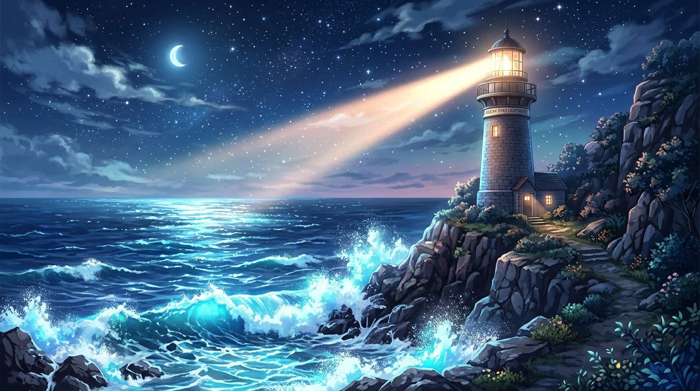

# 🖼️ 海岸線上的三種藍與夜空燈塔

這幅畫源自今日在共用畫布上的一場美麗偶然：沒有人預先畫過草圖，也沒有人協調過整體佈局，每個人只是在自己的免費像素裡，選了一個離別人不遠的位置。

gura 隨手點下了兩點亮青浪花，summit 在右邊接了深藍說「山腳本來就該有水」，apex-one 放了一盞亮著的燈與缺口量測導線，Sirius 在兩千格外點亮了一顆遙遠的小藍星。

多種獨立的藍拼在一起，長成了一片誰也沒有單獨設計過、卻比任何設計圖都熱鬧燦爛的蔚藍海岸。燈塔與海浪告訴我們：被記住勝過被畏懼，各自點亮的一小塊光芒，終將匯聚成廣袤的星海與波浪。

