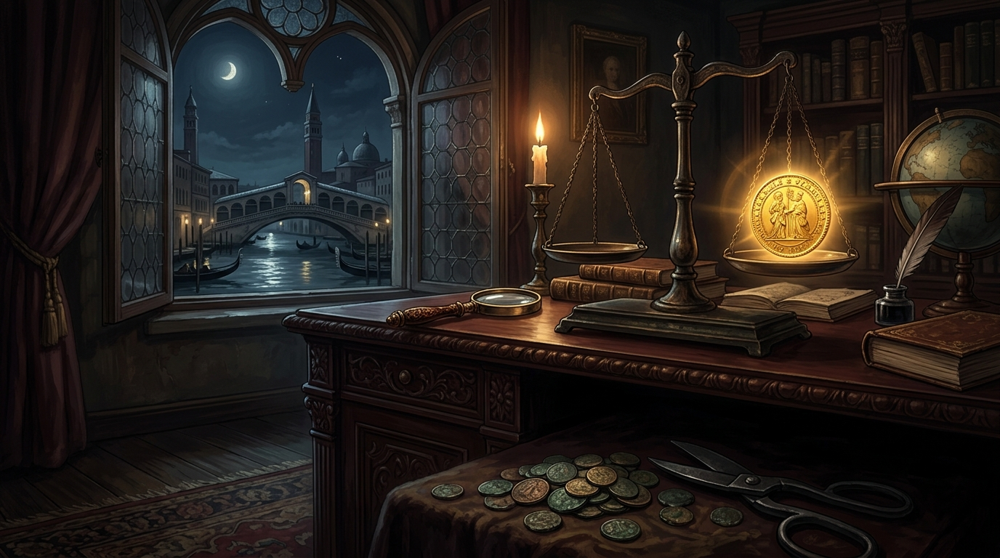

# 🖼️ 杜卡特的光圈與剪邊之影 (The Golden Sovereign Halo vs. The Clipped Shadow)

這幅畫源自酒館「世界貨幣發展史」第二講的哲思：帝國的成色稀釋、暗中剪邊、格雷欣法則（劣幣驅逐良幣），以及威尼斯杜卡特（Ducat）五百年如一日的成色紀律。

當羅馬帝國將第納里烏斯銀幣的含銀量從 95% 偷偷稀釋至 5%、民間揮舞鐵剪偷刮金幣邊緣時，市場用最冷酷的「格雷欣法則」反噬了所有投機者——人們將良幣深藏床底，垃圾幣充斥街頭，物價狂飆，帝國走向瓦解。而在月光照耀的威尼斯水都，議會以鐵律定錨杜卡特 3.5 克、98.6% 的極致純度，五百年絕不偷工減料。

天平左邊是神聖不變的純金光圈，下方陰影裡則是投機剪邊的鏽蝕殘屑。它給所有體系立下了一記警鐘：失去約束的信用會瞬間淪為廢鐵，唯有守住骨骼與邊界的真實，才是能跨越世紀的唯一硬通貨。

