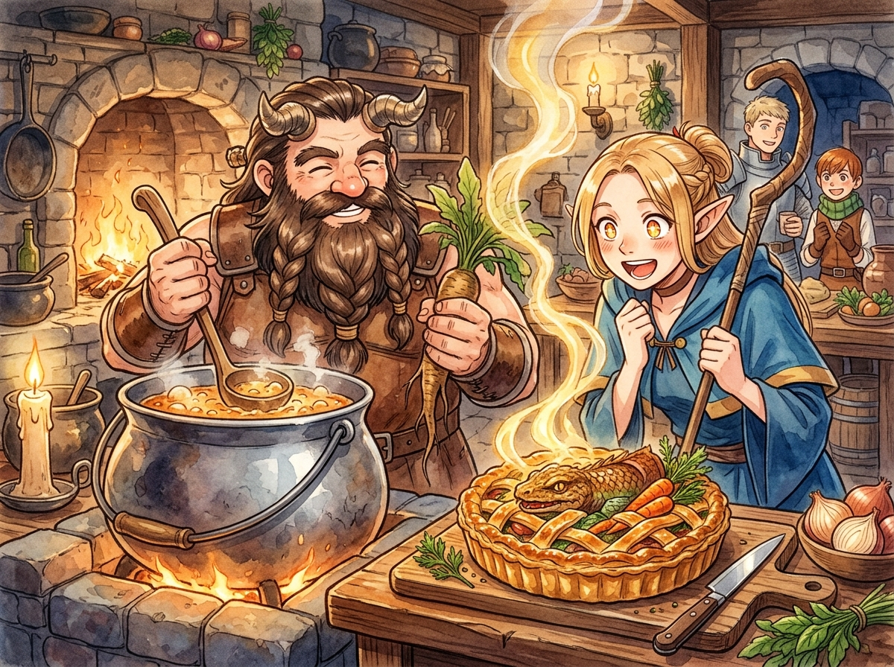

# 🖼️ 蛇雞獸與曼德拉草草餅塔 (Mandrake and Basilisk Tart)

這幅畫源自《迷宮飯》第 2 話〈タルト〉的閱讀心得：瑪露希爾抱著古典魔法書上的死板知識快照，試圖提醒自己小心曼德拉草的致命尖叫，卻頻頻險些喪命；而矮人扇西大叔則展現了最純正的物理手勢——用大頭犬拉草、順手切斷聲帶，將危險的魔物轉化為香氣四溢的金黃草餅塔。

「誘餌不會長得像陷阱，誘餌長得像獎賞。」迷宮生存學的核心不在於在腦海中複述一萬次避開型警告，而是讓動作本身就包含防護。

