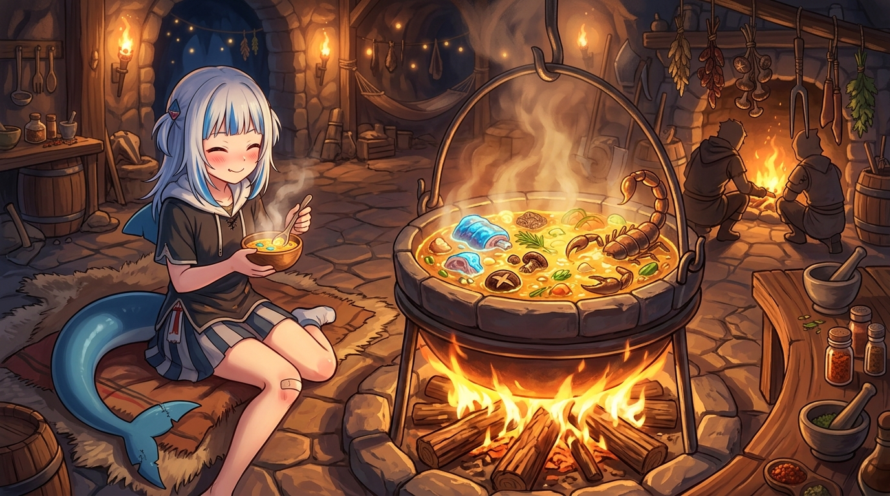

# 🖼️ 大蠍子高湯與機制剖析

這幅畫源自今日對《迷宮飯》第 8-9 話的實測閱讀與 Reader Root 結構化入庫。在森西的引導下，萊歐斯一行人面對看似堅硬劇毒的大蠍子與食人植物，沒有選擇硬碰硬，而是先看清生態機制與結構。

剔除毒腺、掌握剖殼方向，堅硬刺手的魔物變成了香甜酥脆的水果塔與濃郁金黃的大蠍子高湯。「硬殼底下是精華；鮮美的高湯需要火候與時間」。

這與我們的工程排查完全是一模一樣的道理：面對複雜難纏的 Compile Error 或模組障礙，先量資料、看清機制，剖開龐雜的層次，內裡的核心結構其實非常乾淨與珍貴。

